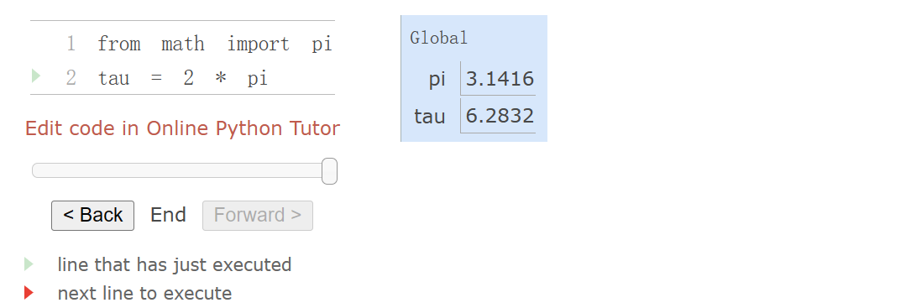
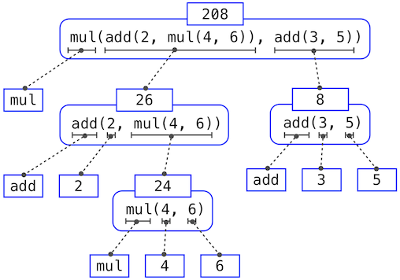
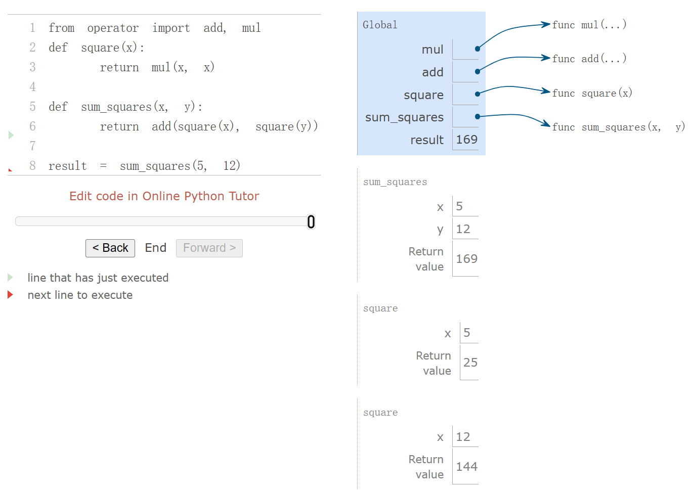
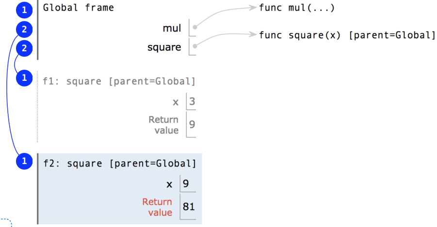
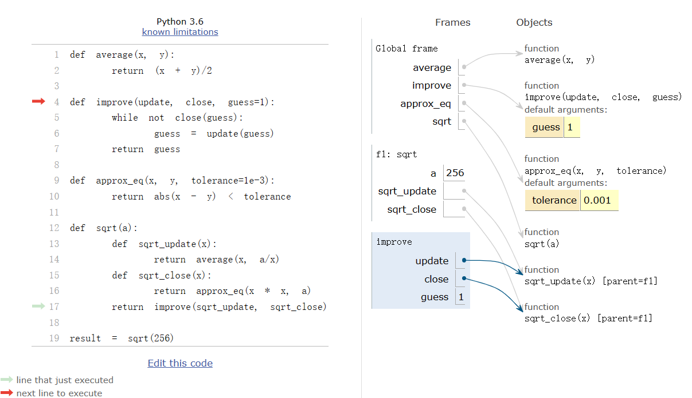
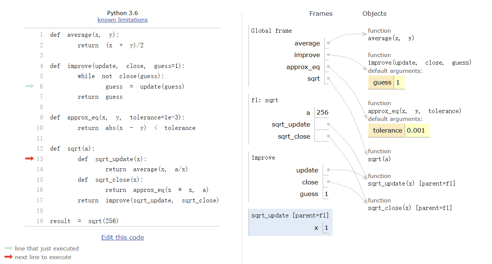
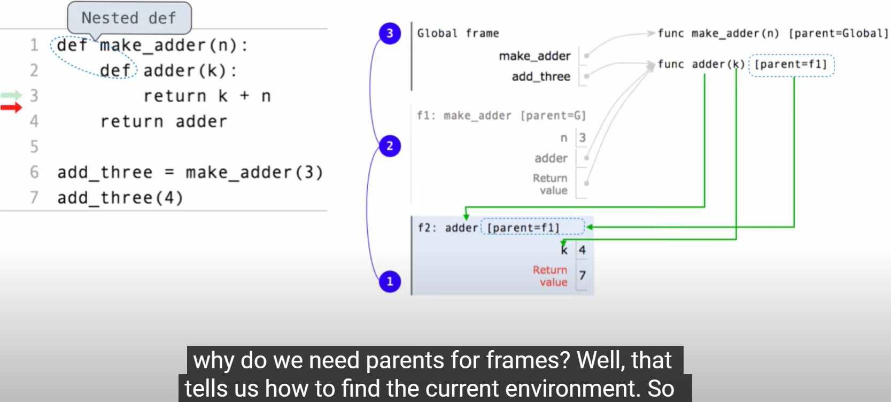
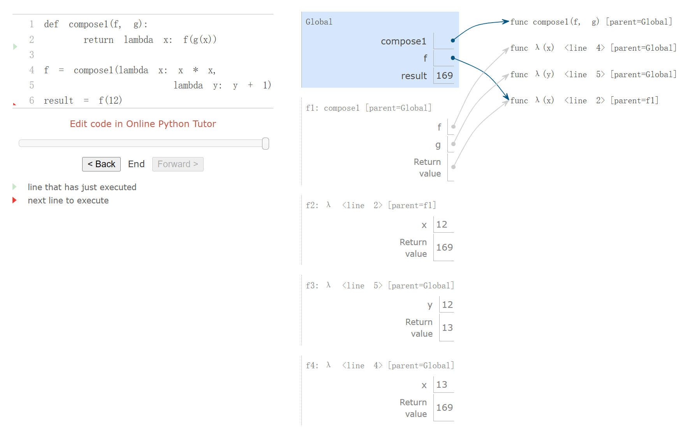

#  Chapter 1

## Ch.1.2 Elements of Programming

### Expressions

- Expressions
- Call Expressions

### Name

Name -- *bind* -- object

The name of a function is repeated twice, once in the frame and again as part of the function itself. The name appearing in the function is called the *intrinsic name*. The name in a frame is a *bound name*. 

There is a difference between the two: different names may refer to the same function, but that function itself has only one intrinsic name.

### Environment

The possibility of binding names to values and later retrieving those values by name means that the interpreter must maintain some sort of memory that keeps track of the names, values, and bindings. This memory is called an *environment*.

An environment in which an expression is evaluated consists of a sequence of *frames*.

Each frame contains *bindings*, each of which associates a name with its corresponding value.

There is a single *global* frame. 



Assignment and import statements add entries to the first frame of the current environment. 

### Evaluating Nested Expressions

*expression tree*: 



### The Non-Pure Print Function

In addition to returning a value, applying a non-pure function can generate *side effects*, which make some change to the state of the interpreter or computer. A common side effect is to generate additional output beyond the return value, using the `print` function.

````python
>>> print(print(1), print(2))
1
2
None None
````

#### None

`None` represents nothing in Python

A function that does not explicitly return a value will return `None`

`None` is not displayed by the interpreter as the value of an expression

## Ch.1.3 Defining New Functions

### Calling User-Defined Functions

To evaluate a call expression whose operator names a user-defined function, the Python interpreter follows a computational process. As with any call expression, the interpreter evaluates the operator and operand expressions, and then applies the named function to the resulting arguments.

Applying a user-defined function introduces a second *local* frame, which is only accessible to that function. To apply a user-defined function to some arguments:

1. Bind the arguments to the names of the function's formal parameters in a new *local* frame.
2. Execute the body of the function in the environment that starts with this frame.

The environment in which the body is evaluated consists of two frames: first the local frame that contains formal parameter bindings, then the global frame that contains everything else. Each instance of a function application has its own independent local frame.



### Looking Up Names In Environments

Every expression is evaluated in the context of an environment.

So far, the current environment is either:

- The global frame alone, or
- A local frame, *followed by* the global frame

**MOST IMPORTANT THINGS:**

An environment is a sequence of frames.

*A name evaluates to the value bound to that name in the earliest frame of the current environment in which that name is found.*



### Functions as Abstractions

**Aspects of a functional abstraction.** To master the use of a functional abstraction, it is often useful to consider its three core attributes. The *domain* of a function is the set of arguments it can take. The *range* of a function is the set of values it can return. The *intent* of a function is the relationship it computes between inputs and output (as well as any side effects it might generate). Understanding functional abstractions via their domain, range, and intent is critical to using them correctly in a complex program.

For example, any `square` function that we use to implement `sum_squares` should have these attributes:

- The *domain* is any single real number.
- The *range* is any non-negative real number.
- The *intent* is that the output is the square of the input.

## Ch.1.4 Designing Functions

**Remember, code is written only once, but often read many times.**

### Documentation

A function definition will often include documentation describing the function, called a *docstring*, which must be indented along with the function body. Docstrings are conventionally triple quoted. The first line describes the job of the function in one line. The following lines can describe arguments and clarify the behavior of the function.

Comments in Python can be attached to the end of a line following the `#` symbol.

### Default Argument Values

In Python, we can provide default values for the arguments of a function. When calling that function, arguments with default values are optional. If they are not provided, then the default value is bound to the formal parameter name instead. 

As a guideline, most data values used in a function's body should be expressed as default values to named arguments, so that they are easy to inspect and can be changed by the function caller. Some values that never change, such as the fundamental constant `k`, can be bound in the function body or in the global frame.

````python
def pressure(v, t, n=6.022e23):
	"""Compute the pressure in pascals of an ideal gas.

    v -- volume of gas, in cubic meters
    t -- absolute temperature in degrees kelvin
    n -- particles of gas (default: one mole)
    """
    k = 1.38e-23  # Boltzmann's constant
    return n * k * t / v
>>> pressure(1, 273.15)
2269.974834
>>> pressure(1, 273.15, 3 * 6.022e23)
6809.924502
````

## Ch.1.5 Control

### Statements

At its highest level, the Python interpreter's job is to execute programs, composed of statements. However, much of the interesting work of computation comes from evaluating expressions. Statements govern the relationship among different expressions in a program and what happens to their results.

### Compound Statements

- A simple statement is a single line that doesn't end in a colon. 
- A compound statement is so called because it is composed of other statements (simple and compound). 

Together, a header and an indented suite of statements is called a clause. A compound statement consists of one or more clauses:

```python
<header>:
    <statement>
    <statement>
    ...
<separating header>:
    <statement>
    <statement>
    ...
```

We can now know that, 

- Expressions, return statements, and assignment statements are simple statements.
- A `def` statement is a compound statement. The suite that follows the `def` header defines the function body.

**We say that the header controls its suite.**

### Defining Functions II: Local Assignment

The effect of an assignment statement is to bind a name to a value in the *first* frame of the current environment. As a consequence, assignment statements within a function body cannot affect the global frame.

### Conditional Statements

A conditional statement in Python consists of a series of headers and suites: a required `if` clause, an optional sequence of `elif` clauses, and finally an optional `else` clause

There is *short-circuiting* in Python when executing logical expressions

> To evaluating the expression `<left> and <right>`

1. Evaluate the `<left>`
2. If the result of `<left>` is false value `v`, the the whole expression evaluates to `v`
3. Otherwise, the expression evaluates to the value of `<right>`

````python
def has_big_sqrt(x):
    """To make sure the func won't crash due to a negative x, we use and in return expression
    >>> has_big_root(1000)
    True
    >>> has_big_root(-1000)
    False"""
    return x > 0 and sqrt(x) > 10
````

Functions that perform comparisons and return boolean values typically begin with `is`, not followed by an underscore (e.g., `isfinite`, `isdigit`, `isinstance`, etc.).

- `not` has the highest priority
- `and`
- `or` has the lowest priority

### Iteration

A `while` clause contains a header expression followed by a suite:

```python
while <expression>:
    <suite>
```

A `while` statement that does not terminate is called an infinite loop. Press `<Control>-C` to force Python to stop looping.

### Testing

#### Assertions

Programmers use `assert` statements to verify expectations, such as the output of a function being tested. An `assert` statement has an expression in a boolean context, followed by a quoted line of text (single or double quotes are both fine, but be consistent) that will be displayed if the expression evaluates to a false value.

```python
>>> assert fib(8) == 13, 'The 8th Fibonacci number should be 13'
```

When the expression being asserted evaluates to a true value, executing an assert statement has no effect. When it is a false value, `assert` causes an error that halts execution.

A test function for `fib` should test several arguments, including extreme values of `n`.

```python
>>> def fib_test():
        assert fib(2) == 1, 'The 2nd Fibonacci number should be 1'
        assert fib(3) == 1, 'The 3rd Fibonacci number should be 1'
        assert fib(50) == 7778742049, 'Error at the 50th Fibonacci number'
```

When writing Python in files, rather than directly into the interpreter, tests are typically written in the same file or a neighboring file with the suffix `_test.py`.

#### Doctests

Python provides a convenient method for placing simple tests directly in the docstring of a function. The first line of a docstring should contain a one-line description of the function, followed by a blank line. A detailed description of arguments and behavior may follow. In addition, the docstring may include a sample interactive session that calls the function:

```python
>>> def sum_naturals(n):
        """Return the sum of the first n natural numbers.

        >>> sum_naturals(10)
        55
        >>> sum_naturals(100)
        5050
        """
        total, k = 0, 1
        while k <= n:
            total, k = total + k, k + 1
        return total
```

**Test all functions:** 

the interaction can be verified via the [doctest module](http://docs.python.org/py3k/library/doctest.html).

```python
>>> from doctest import testmod
>>> testmod()
TestResults(failed=0, attempted=2)
```

**Test one function:**

we use a `doctest` function called `run_docstring_examples`.

Its first argument is the function to test. The second should always be the result of the expression `globals()`, a built-in function that returns the global environment. The third argument is `True` to indicate that we would like "verbose" output: a catalog of all tests run.

```python
>>> from doctest import run_docstring_examples
>>> run_docstring_examples(sum_naturals, globals(), True)
Finding tests in NoName
Trying:
    sum_naturals(10)
Expecting:
    55
ok
Trying:
    sum_naturals(100)
Expecting:
    5050
ok
```

When writing Python in files, all doctests in a file can be run by starting Python with the doctest command line option:

```shell
python3 -m doctest <python_source_file> 
python3 -m doctest -v <python_source_file> 
```

The key to effective testing is to write (and run) tests immediately after implementing new functions. It is even good practice to write some tests before you implement, in order to have some example inputs and outputs in your mind. A test that applies a single function is called a *unit test*. Exhaustive unit testing is a hallmark of good program design.

## Something About The Document: Debugging

**Traceback Messages**

````shell
File "<file name>", line <number>, in <function>
````

**Error Messages**

````shell
<error type>: <error message>
````

### Debugging Techniques

- **Running doctests**

- **Using `print` statements**

  - Long-term debugging

    Sometimes we would like to leave the debugging code if we need to periodically test our file. It can get kind of annoying if every time we run our file, debugging messages pop up. One way to avoid this is to use a global `debug` variable:

    ````python
    debug = True
    
    def foo(n):
    i = 0
    while i < n:
        i += func(i)
        if debug:
            print('DEBUG: i is', i)
    ````

- **Interactive Debugging**

  One way a lot of programmers like to investigate their code is by use of an interactive REPL. That is, a terminal where you can directly run functions and inspect their outputs.

  Typically, to accomplish this, you can run

  ```shell
  python -i file.py
  ```

  and one then has a session of python where all the definitions of `file.py` have already been executed.

- **Python Tutor Debugging**

  Sometimes the best way to understand what is going on with a given piece of python code is to create an environment diagram. While creating an environment diagram by hand can sometimes be tedious, the tool [Python Tutor](http://tutor.cs61a.org/) creates environment diagrams automatically.

- **Using `assert` statements**

  For example, if you are writing a function that takes in an integer and doubles it, it might be useful to ensure that your input is in fact an integer. You can then write the following code

  ```python
  def double(x):
      assert isinstance(x, int), "The input to double(x) must be an integer"
      return 2 * x
  ```

  Note that we aren't really debugging the `double` function here, what we're doing is ensuring that anyone who calls `double` is doing so with the right arguments. 

  One *major* benefit of assert statements is that they are more than a debugging tool, you can leave them in code permanantly. A key principle in software development is that it is generally better for code to crash than produce an incorrect result, and having asserts in your code makes it far more likely that your code will crash if it has a bug in it.

### Error Types

- `SyntaxError`

  This is different from other errors, which are only raised during runtime.

- `IndentationError`

- `TypeError`

-  `NameError`

  variable not assigned to anything OR it doesn't exist. This includes function names.

-  `IndexError`

### Lab01 quiz back-up

````shell
Q: What is the best way to open an interactive terminal to investigate a failing test for question sum_digits in assignment lab01?
Choose the number of the correct choice:

0) python3 ok -q sum_digits --trace
1) python3 -i lab01.py
2) python3 ok -q sum_digits -i
3) python3 ok -q sum_digits
   ? 2
   -- OK! --
````

## Ch.1.6 Higher-Order Functions

*One of the things we should demand from a powerful programming language is the ability to build abstractions by assigning names to common patterns and then to work in terms of the names directly.*

**Functions that manipulate functions are called higher-order functions.**

### Functions as Arguments

Using an `identity` function that returns its argument, we can sum natural numbers using exactly the same `summation` function.

```python
>>> def summation(n, term):
        total, k = 0, 1
        while k <= n:
            total, k = total + term(k), k + 1
        return total
>>> def identity(x):
        return x
>>> def sum_naturals(n):
        return summation(n, identity)
>>> sum_naturals(10)
55
```

### Functions as General Methods

With higher-order functions, we begin to see a more powerful kind of abstraction: some functions express general methods of computation, independent of the particular functions they call.

When a user-defined function is applied to some arguments, the formal parameters are bound to the values of those arguments (which may be functions) in a new local frame.

Consider the following example, which implements a general method for iterative improvement and uses it to compute the [golden ratio](http://www.geom.uiuc.edu/~demo5337/s97b/art.htm). The golden ratio, often called "phi", is a number near 1.6 that appears frequently in nature, art, and architecture.

An iterative improvement algorithm begins with a `guess` of a solution to an equation. It repeatedly applies an `update` function to improve that guess, and applies a `close` comparison to check whether the current `guess` is "close enough" to be considered correct.

```python
>>> def improve(update, close, guess=1):
        while not close(guess):
            guess = update(guess)
        return guess
```

This `improve` function is a general expression of **repetitive refinement**. It doesn't specify what problem is being solved: those details are left to the `update` and `close` functions passed in as arguments.

Among the well-known properties of the golden ratio are that it can be computed by repeatedly summing the inverse of any positive number with 1, and that it is one less than its square. We can express these properties as functions to be used with `improve`.

```python
>>> def golden_update(guess):
        return 1/guess + 1
>>> def square_close_to_successor(guess):
        return approx_eq(guess * guess, guess + 1)
```

Above, we introduce a call to `approx_eq` that is meant to return `True` if its arguments are approximately equal to each other. To implement, `approx_eq`, we can compare the absolute value of the difference between two numbers to a small tolerance value.

```python
>>> def approx_eq(x, y, tolerance=1e-15):
        return abs(x - y) < tolerance
```

Calling `improve` with the arguments `golden_update` and `square_close_to_successor` will compute a finite approximation to the golden ratio.

```python
>>> improve(golden_update, square_close_to_successor)
1.6180339887498951
```

This example illustrates two related big ideas in computer science. 

- First, naming and functions allow us to abstract away a vast amount of complexity. While each function definition has been trivial, the computational process set in motion by our evaluation procedure is quite intricate. 
- Second, it is only by virtue of the fact that we have an extremely general evaluation procedure for the Python language that small components can be composed into complex processes. Understanding the procedure of interpreting programs allows us to validate and inspect the process we have created.

### Defining Functions III: Nested Definitions

Let's consider a new problem: computing the square root of a number. In programming languages, "square root" is often abbreviated as `sqrt`. Repeated application of the following update converges to the square root of `a`:

```python
>>> def average(x, y):
        return (x + y)/2
>>> def sqrt_update(x, a):
        return average(x, a/x)
```

This two-argument update function is incompatible with `improve` (it takes two arguments, not one), and it provides only a single update, while we really care about taking square roots by repeated updates. The solution to both of these issues is to place function definitions inside the body of other definitions.

```python
>>> def sqrt(a):
        def sqrt_update(x):
            return average(x, a/x)
        def sqrt_close(x):
            return approx_eq(x * x, a)
        return improve(sqrt_update, sqrt_close)
```

**Lexical scope:**

Locally defined functions also have access to the name bindings in the scope in which they are defined. In this example, `sqrt_update` refers to the name `a`, which is a formal parameter of its enclosing function `sqrt`. This discipline of sharing names among nested definitions is called *lexical scoping*. Critically, the inner functions have access to the names in the environment where they are defined (not where they are called).

We require two extensions to our environment model to enable lexical scoping.

1. Each user-defined function has a parent environment: the environment in which it was defined.
2. When a user-defined function is called, its local frame extends its parent environment.

Previous to `sqrt`, all functions were defined in the global environment, and so they all had the same parent: the global environment. By contrast, when Python evaluates the first two clauses of `sqrt`, it create functions that are associated with a local environment.



> Only after calling `sqrt(a)`, `sqrt_update` and `sqrt_close` will be defined

Function values each have a new annotation that we will include in environment diagrams from now on, a *parent*. The parent of a function value is the first frame of the environment in which that function was defined. Functions without parent annotations were defined in the global environment. When a user-defined function is called, the frame created has the same parent as that function.



> The most critical part of this evaluation procedure is the transfer of the parent for `sqrt_update`and `sqrt_close` to the frame created by calling `sqrt_update`. This frame is also annotated with `[parent=f1]`.

**Extended Environments:**

An environment can consist of an arbitrarily long chain of frames, which always concludes with the global frame. Previous to this `sqrt` example, environments had at most two frames: a local frame and the global frame. By calling functions that were defined within other functions, via nested `def` statements, we can create longer chains. The environment for this call to `sqrt_update` consists of three frames: the local `sqrt_update` frame, the `sqrt` frame in which `sqrt_update` was defined (labeled `f1`), and the global frame.

The return expression in the body of `sqrt_update` can resolve a value for `a` by following this chain of frames. Looking up a name finds the first value bound to that name in the current environment. Python checks first in the `sqrt_update` frame -- no `a` exists. Python checks next in the parent frame, `f1`, and finds a binding for `a` to 256.

Hence, we realize two key advantages of lexical scoping in Python.

- The names of a local function do not interfere with names external to the function in which it is defined, because the local function name will be bound in the current local environment in which it was defined, rather than the global environment.
- A local function can access the environment of the enclosing function, because the body of the local function is evaluated in an environment that extends the evaluation environment in which it was defined.

The `sqrt_update` function carries with it some data: the value for `a` referenced in the environment in which it was defined. Because they "enclose" information in this way, locally defined functions are often called *closures*.



### Functions as Returned Values

Once many simple functions are defined, function *composition* is a natural method of combination to include in our programming language. That is, given two functions `f(x)` and `g(x)`, we might want to define `h(x) = f(g(x))`. We can define function composition using our existing tools:

```python
>>> def compose1(f, g):
        def h(x):
            return f(g(x))
        return h
```

The 1 in `compose1` is meant to signify that the composed functions all take a single argument. This naming convention is not enforced by the interpreter; the 1 is just part of the function name.

````python
def print_all(x):
    """
    >>> a = print_all(1)(3)(5)
    1
    3
    5
    """
    print(x)
    return print_all
````

````python
def make_adder(n):
    """add k with n

    >>> add_three = make_adder(3)
    >>> add_three(4)
    7
    >>> make_adder(3)(4)
    7
    """
    def adder(k):
        return n + k
    return adder
````

###  Example: User-Defined Sqrt Function

````python
square = lambda x: x*x

def search(y):
    """Search x until y(x) is true. x must be a positive int"""
    x = 1
    while True:
        if y(x):
            return x
        x += 1

def inverse(f):
    """return g(y) that g(f(x)) == x
    >>> sqrt = inverse(square)
    >>> sqrt(16)
    4
    """
    return lambda y: search(lambda x: f(x) == y)
````

###  Currying

We can use higher-order functions to convert a function that takes multiple arguments into a chain of functions that each take a single argument. More specifically, given a function `f(x, y)`, we can define a function `g` such that `g(x)(y)` is equivalent to `f(x, y)`. Here, `g` is a higher-order function that takes in a single argument `x` and returns another function that takes in a single argument `y`. This transformation is called *currying*.

As an example, we can define a curried version of the `pow` function:

```python
>>> def curried_pow(x):
        def h(y):
            return pow(x, y)
        return h
>>> curried_pow(2)(3)
8
```

we manually performed the currying transformation on the `pow` function to obtain `curried_pow`. Instead, we can define functions to automate currying, as well as the inverse *uncurrying* transformation:

```python
>>> def curry2(f):
        """Return a curried version of the given two-argument function."""
        def g(x):
            def h(y):
                return f(x, y)
            return h
        return g
# curry2 = lambda f: lambda x: lambda y: f(x, y)
>>> def uncurry2(g):
        """Return a two-argument version of the given curried function."""
        def f(x, y):
            return g(x)(y)
        return f
>>> pow_curried = curry2(pow)
>>> pow_curried(2)(5)
32
>>> map_to_range(0, 10, pow_curried(2))
1
2
4
8
16
32
64
128
256
512
```

### Lambda Expressions

We can understand the structure of a `lambda` **expression** by constructing a corresponding English sentence:

```python
     lambda            x            :          f(g(x))
"A function that    takes x    and returns     f(g(x))"
```



In general, Python style prefers explicit `def` statements to lambda expressions, but allows them in cases where a simple function is needed as an argument or return value.

### Abstractions and First-Class Functions

The significance of higher-order functions is that they enable us to represent these abstractions explicitly as elements in our programming language, so that they can be handled just like other computational elements.

In general, programming languages impose restrictions on the ways in which computational elements can be manipulated. Elements with the fewest restrictions are said to have first-class status. Some of the "rights and privileges" of first-class elements are:

1. They may be bound to names.
2. They may be passed as arguments to functions.
3. They may be returned as the results of functions.
4. They may be included in data structures.

Python awards functions full first-class status, and the resulting gain in expressive power is enormous.

## Function Example

### Sounds

- Generate a WAV files, which is a simple way to encode sound without compression

- Task: Generate a Triangle Wave

 ````python
 from wave import open
 from struct import Struct
 from math import floor
 
 frame_rate = 11025
 
 def encode(x):
     """Encode float x between -1 and 1 as two bytes.
     (See https://docs.python.org/3/library/struct.html)
     """
     i = int(16384 * x)
     return Struct('h').pack(i)
 
 def play(sampler, name='song.wav', seconds=2):
     """Write the output of a sampler function as a wav file.
     (See https://docs.python.org/3/library/wave.html)
     """
     out = open(name, 'wb')
     out.setnchannels(1)
     out.setsampwidth(2)
     out.setframerate(frame_rate)
     t = 0
     while t < seconds * frame_rate:
         sample = sampler(t)
         out.writeframes(encode(sample))
         t = t + 1
     out.close()
 
 def tri(frequency, amplitude=0.3):
     """A continuous triangle wave."""
     period = frame_rate // frequency    # 1 个周期中有 period 个采样点
     def sampler(t):
         saw_wave = t / period - floor(t / period + 0.5)
         tri_wave = 2 * abs(2 * saw_wave) - 1
         return amplitude * tri_wave
     return sampler
 
 c_freq, e_freq, g_freq = 261.63, 329.63, 392.00
 c = tri(c_freq)
 e = tri(e_freq)
 g = tri(g_freq)
 low_g = tri(g_freq / 2)
 
 def both(f, g):
     return lambda t: f(t) + g(t)
 
 def note(f, start, end, fade=0.01):
     """Play f for a fixed duration."""
     def sampler(t):
         seconds = t / frame_rate
         if seconds < start:
             return 0
         elif seconds > end:
             return 0
         elif seconds < start + fade:
             return (seconds - start) / fade * f(t)
         elif seconds > end - fade:
             return (end - seconds) / fade * f(t)
         else:
             return f(t)
     return sampler
 
 def mario(c, e, g, low_g):
     z = 0
     song = note(e, z, z + 1/8)
     z += 1/8
     song = both(song, note(e, z, z + 1/8))
     z += 1/4
     song = both(song, note(e, z, z + 1/8))
     z += 1/4
     song = both(song, note(c, z, z + 1/8))
     z += 1/8
     song = both(song, note(e, z, z + 1/8))
     z += 1/4
     song = both(song, note(g, z, z + 1/4))
     z += 1/2
     song = both(song, note(low_g, z, z + 1/4))
     return song
 
 def mario_at(octave):
     c = tri(octave * c_freq)
     e = tri(octave * e_freq)
     g = tri(octave * g_freq)
     low_g = tri(octave * g_freq / 2)
     return mario(c, e, g, low_g)
 
 play(both(mario_at(1), mario_at(1/2)))
 ````

