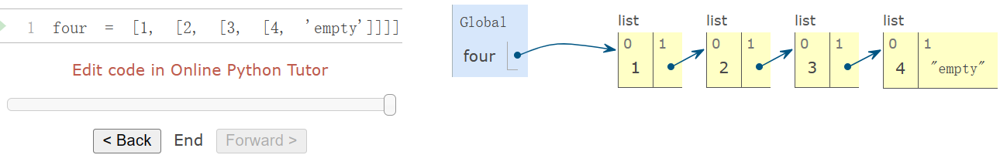

# Ch.2.1 & Ch.2.3

## Ch.2.1  Introduction

Every value in Python has a *class* that determines what type of value it is. Values that share a class also share behavior. For example, the integers `1` and `2` are both instances of the `int` class. 

Python includes three native numeric types: integers (`int`), real numbers (`float`), and complex numbers (`complex`).

```python
>>> type(1.5)
<class 'float'>
>>> type(1+1j)
<class 'complex'>
```

### Floats

In particular, `int` objects represent integers exactly, without any approximation or limits on their size. On the other hand, `float` objects can represent a wide range of fractional numbers, but not all numbers can be represented exactly, and there are minimum and maximum values. Therefore, `float` values should be treated as approximations to real values.

```python
>>> 7 / 3 * 3
7.0
>>> 1 / 3 * 7 * 3
6.999999999999999
```

## Ch.2.3  Sequences

Sequences are not instances of a particular built-in type or abstract data representation, but instead a collection of behaviors that are shared among several different types of data.

### Lists

```python
>>> digits = [1, 8, 2, 8]
>>> len(digits)
4
>>> digits[3]
8
>>> [2, 7] + digits * 2
[2, 7, 1, 8, 2, 8, 1, 8, 2, 8]
# Any values can be included in a list, including another list.
>>> pairs = [[10, 20], [30, 40]]
>>> pairs[1]
[30, 40]
>>> pairs[1][0]
30
```

### Sequence Iteration

The Python `for` statement can simplify the while loop which can traversal the whole list by iterating over the element values directly without introducing the name `index` at all.

```python
>>> def count(s, value):
        """Count the number of occurrences of value in sequence s."""
        total = 0
        for elem in s:
            if elem == value:
                total = total + 1
        return total
>>> count(digits, 8)
2
```

A `for` statement consists of a single clause with the form:

```python
for <name> in <expression>:
    <suite>
```

A `for` statement is executed by the following procedure:

1. Evaluate the header `<expression>`, which must yield an iterable value.
2. For each element value in that iterable value, in order:
   1. Bind `<name>` to that value in the current frame.
   2. Execute the `<suite>`.

> This execution procedure refers to *iterable values*. Lists are a type of sequence, and sequences are iterable values. Their elements are considered in their sequential order. Python includes other iterable types, but we will focus on sequences for now

#### Sequence unpacking 

A common pattern in programs is to have a sequence of elements that are themselves sequences, but all of a fixed length. A `for` statement may include multiple names in its header to "unpack" each element sequence into its respective elements.

```python
>>> pairs = [[1, 2], [2, 2], [2, 3], [4, 4]]
```

and wish to find the number of these pairs that have the same first and second element.

```python
>>> same_count = 0
```

The following `for` statement with two names in its header will bind each name `x` and `y` to the first and second elements in each pair, respectively.

```python
>>> for x, y in pairs:
        if x == y:
            same_count = same_count + 1
>>> same_count
2
```

#### Ranges

A `range` is **another built-in type of sequence** in Python, which represents a range of integers. Ranges are created with `range`, which takes two integer arguments: the first number and one beyond the last number in the desired range.

```python
>>> range(1, 10)  # Includes 1, but not 10
range(1, 10)
>>> type(range(1, 10))
<class 'range'>
```

Calling the `list` constructor on a range evaluates to a list with the same elements as the range, so that the elements can be easily inspected.

```python
>>> list(range(5, 8))
[5, 6, 7]
```

If only one argument is given, it is interpreted as one beyond the last value for a range that starts at 0.

```python
>>> list(range(4))
[0, 1, 2, 3]
```

Ranges commonly appear as the expression in a `for` header to specify the number of times that the suite should be executed: A common convention is to use a single underscore character for the name in the `for` header if the name is unused in the suite:

```python
>>> for _ in range(3):
        print('Go Bears!')
```

### Sequence Processing

#### List Comprehensions

Many sequence processing operations can be expressed by evaluating a fixed expression for each element in a sequence and collecting the resulting values in a result sequence. In Python, a list comprehension is an expression that performs such a computation.

````python
>>> odds = [1, 3, 5, 7, 9]
>>> [x+1 for x in odds]
[2, 4, 6, 8, 10]
````

Another common sequence processing operation is to select a subset of values that satisfy some condition.

```python
>>> [x for x in odds if 25 % x == 0]
[1, 5]
```

The general form of a list comprehension is:

```python
[<map expression> for <name> in <sequence expression> if <filter expression>]
```

#### Aggregation

A third common pattern in sequence processing is to aggregate all values in a sequence into a single value. The built-in functions `sum`, `min`, and `max` are all examples of aggregation functions.

**sum:** `sum(iterable[, start])`

````python
>>> sum([[1, 2], [3]], [])
[1, 2, 3]
>>> sum([1, 2, 3])
6
````
**all:** `all(iterable) -> bool` 
Return True if bool(x) is True for all values x in the iterable. 
If the iterable is empty, return True.

> By combining the patterns of evaluating an expression for each element, selecting a subset of elements, and aggregating elements, we can solve problems using a sequence processing approach.
>
> A perfect number is a positive integer that is equal to the sum of its divisors. The divisors of `n` are positive integers less than `n` that divide evenly into `n`. Listing the divisors of `n` can be expressed with a list comprehension.
>
> ```python
> >>> def divisors(n):
>         return [1] + [x for x in range(2, n) if n % x == 0]
> >>> divisors(4)
> [1, 2]
> >>> divisors(12)
> [1, 2, 3, 4, 6]
> ```
>
> Using `divisors`, we can compute all perfect numbers from 1 to 1000 with another list comprehension. (1 is typically considered to be a perfect number as well, but it does not qualify under our definition of `divisors`.)
>
> ```python
> >>> [n for n in range(1, 1000) if sum(divisors(n)) == n]
> [6, 28, 496]
> ```

#### Higher-Order Functions

Many forms of aggregation can be expressed as repeatedly applying a two-argument function to the `reduced` value so far and each element in turn.

```python
>>> def reduce(reduce_fn, s, initial):
        reduced = initial
        for x in s:
            reduced = reduce_fn(reduced, x)
        return reduced
```

For example, `reduce` can be used to multiply together all elements of a sequence. Using `mul` as the `reduce_fn` and 1 as the `initial` value, `reduce` can be used to multiply together a sequence of numbers.

#### Conventional Names

In Python, the built-in `map` and `filter` are generalizations of these functions that do not return lists. These functions are discussed in Chapter 4. The definitions above are equivalent to applying the `list` constructor to the result of built-in `map` and `filter` calls.

```python
>>> apply_to_all = lambda map_fn, s: list(map(map_fn, s))
>>> keep_if = lambda filter_fn, s: list(filter(filter_fn, s))
```

The `reduce` function is built into the `functools` module of the Python standard library. In this version, the `initial` argument is optional.

```python
>>> from functools import reduce
>>> from operator import mul
>>> def product(s):
        return reduce(mul, s)
>>> product([1, 2, 3, 4, 5])
120
```

### Sequence Abstraction

> We have introduced two native data types that satisfy the sequence abstraction: lists and ranges. Both satisfy the conditions with which we began this section: length and element selection. Python includes two more behaviors of sequence types that extend the sequence abstraction.

#### Membership

Python has two operators `in` and `not in` that evaluate to `True` or `False` depending on whether an element appears in a sequence

#### Slicing

A *slice* of a sequence is any contiguous span of the original sequence, designated by a pair of integers. As with the `range` constructor, the first integer indicates the starting index of the slice and the second indicates one beyond the ending index.

In Python, sequence slicing is expressed similarly to element selection, using square brackets. A colon separates the starting and ending indices. Any bound that is omitted is assumed to be an extreme value: 0 for the starting index, and the length of the sequence for the ending index.

**Python creates a new list with the elements from the starting index up to (but not including) the ending index.**

````python
>>> a = [1, 2, 3, 4, 5, 6]
>>> b = a[3:1:-1]
[4, 3]
````

### Strings

The native data type for text in Python is called a string, and corresponds to the constructor `str`.

- String literals can express arbitrary text, surrounded by either single or double quotation marks.
  - We have seen strings already in our code, as docstrings, in calls to `print`, and as error messages in `assert` statements.

- Strings satisfy the two basic conditions of a sequence that we introduced at the beginning of this section: they have a length and they support element selection.
- The elements of a string are themselves strings that have only a single character. A character is any single letter of the alphabet, punctuation mark, or other symbol. Unlike many other programming languages, Python does not have a separate character type; any text is a string, and strings that represent single characters have a length of 1.
- Like lists, strings can also be combined via addition and multiplication.

#### Membership

The membership operator `in` applies to strings, but has an entirely different behavior than when it is applied to sequences. It matches substrings rather than elements.

```python
>>> 'here' in "Where's Waldo?"
True
```

#### Multiline Literals

Strings aren't limited to a single line. Triple quotes delimit string literals that span multiple lines. We have used this triple quoting extensively already for docstrings.

```python
>>> """The Zen of Python
claims, Readability counts.
Read more: import this."""
'The Zen of Python\nclaims, "Readability counts."\nRead more: import this.'
```

In the printed result above, the `\n` (pronounced "*backslash en*") is a single element that represents a new line. Although it appears as two characters (backslash and "n"), it is considered a single character for the purposes of length and element selection.

#### String Coercion

 A string can be created from any object in Python by calling the `str` constructor function with an object value as its argument. This feature of strings is useful for constructing descriptive strings from objects of various types.

```python
>>> str(2) + ' is an element of ' + str(digits)
'2 is an element of [1, 8, 2, 8]'
```

### Trees

> Our ability to use lists as the elements of other lists provides a new means of combination in our programming language. This ability is called a *closure property* of a data type. In general, a method for combining data values has a closure property if the result of combination can itself be combined using the same method. Closure is the key to power in any means of combination because it permits us to create hierarchical structures — structures made up of parts, which themselves are made up of parts, and so on.

Nesting lists within lists can introduce complexity. The *tree* is a fundamental data abstraction that imposes regularity on how hierarchical values are structured and manipulated.

A tree has a root label and a sequence of branches. Each branch of a tree is a tree. A tree with no branches is called a leaf. Any tree contained within a tree is called a sub-tree of that tree (such as a branch of a branch). The root of each sub-tree of a tree is called a node in that tree.

The data abstraction for a tree consists of the constructor `tree` and the selectors `label` and `branches`. We begin with a simplified version.

```python
>>> def tree(root_label, branches=[]):
        for branch in branches:
            assert is_tree(branch), 'branches must be trees'
        return [root_label] + list(branches)
>>> def label(tree):
        return tree[0]
>>> def branches(tree):
        return tree[1:]
```

A tree is well-formed only if it has a root label and all branches are also trees. The `is_tree` function is applied in the `tree` constructor to verify that all branches are well-formed.

```python
>>> def is_tree(tree):
        if type(tree) != list or len(tree) < 1:
            return False
        for branch in branches(tree):
            if not is_tree(branch):
                return False
        return True
```

The `is_leaf` function checks whether or not a tree has branches.

```python
>>> def is_leaf(tree):
        return not branches(tree)
```

Trees can be constructed by nested expressions. The following tree `t` has root label 3 and two branches.

```python
>>> t = tree(3, [tree(1), tree(2, [tree(1), tree(1)])])
>>> t
[3, [1], [2, [1], [1]]]
>>> label(t)
3
>>> branches(t)
[[1], [2, [1], [1]]]
>>> label(branches(t)[1])
2
>>> is_leaf(t)
False
>>> is_leaf(branches(t)[0])
True
```

Tree-recursive functions can be used to construct trees. For example, the nth Fibonacci tree has a root label of the nth Fibonacci number and, for `n > 1`, two branches that are also Fibonacci trees. A Fibonacci tree illustrates the tree-recursive computation of a Fibonacci number.

```python
>>> def fib_tree(n):
        if n == 0 or n == 1:
            return tree(n)
        else:
            left, right = fib_tree(n-2), fib_tree(n-1)
            fib_n = label(left) + label(right)
            return tree(fib_n, [left, right])
>>> fib_tree(5)
[5, [2, [1], [1, [0], [1]]], [3, [1, [0], [1]], [2, [1], [1, [0], [1]]]]]
```

Tree-recursive functions are also used to process trees. For example, the `count_leaves` function counts the leaves of a tree.

```python
>>> def count_leaves(tree):
      if is_leaf(tree):
          return 1
      else:
          branch_counts = [count_leaves(b) for b in branches(tree)]
          return sum(branch_counts)
>>> count_leaves(fib_tree(5))
8
```

#### Partition trees

Trees can also be used to represent the partitions of an integer. A partition tree for `n` using parts up to size `m` is a binary (two branch) tree that represents the choices taken during computation. In a non-leaf partition tree:

- the left (index 0) branch contains all ways of partitioning `n` using at least one `m`,
- the right (index 1) branch contains partitions using parts up to `m-1`, and
- the root label is `m`.

The labels at the leaves of a partition tree express whether the path from the root of the tree to the leaf represents a successful partition of `n`.

```python
>>> def partition_tree(n, m):
        """Return a partition tree of n using parts of up to m."""
        if n == 0:
            return tree(True)
        elif n < 0 or m == 0:
            return tree(False)
        else:
            left = partition_tree(n-m, m)
            right = partition_tree(n, m-1)
            return tree(m, [left, right])
>>> partition_tree(2, 2)
[2, [True], [1, [1, [True], [False]], [False]]]
```

Printing the partitions from a partition tree is another tree-recursive process that traverses the tree, constructing each partition as a list. Whenever a `True` leaf is reached, the partition is printed.

```python
>>> def print_parts(tree, partition=[]):
        if is_leaf(tree):
            if label(tree):
                print(' + '.join(partition))
        else:
            left, right = branches(tree)
            m = str(label(tree))
            print_parts(left, partition + [m])
            print_parts(right, partition)
>>> print_parts(partition_tree(6, 4))
4 + 2
4 + 1 + 1
3 + 3
3 + 2 + 1
3 + 1 + 1 + 1
2 + 2 + 2
2 + 2 + 1 + 1
2 + 1 + 1 + 1 + 1
1 + 1 + 1 + 1 + 1 + 1
```

Slicing can be used on the branches of a tree as well. For example, we may want to place a restriction on the number of branches in a tree. A binary tree is either a leaf or a sequence of at most two binary trees. A common tree transformation called *binarization* computes a binary tree from an original tree by grouping together adjacent branches.

```python
>>> def right_binarize(tree):
        """Construct a right-branching binary tree."""
        if is_leaf(tree):
            return tree
        if len(tree) > 2:
            tree = [tree[0], tree[1:]]
        return [right_binarize(b) for b in tree]
>>> right_binarize([1, 2, 3, 4, 5, 6, 7])
[1, [2, [3, [4, [5, [6, 7]]]]]]
```

### Linked Lists

So far, we have used only native types to represent sequences. However, we can also develop sequence representations that are not built into Python. A common representation of a sequence constructed from nested pairs is called a *linked list*. The environment diagram below illustrates the linked list representation of a four-element sequence containing 1, 2, 3, and 4.



A linked list is a pair containing the first element of the sequence (in this case 1) and the rest of the sequence (in this case a representation of 2, 3, 4). The second element is also a linked list. The rest of the inner-most linked list containing only 4 is `'empty'`, a value that represents an empty linked list.

Linked lists have recursive structure: the rest of a linked list is a linked list or `'empty'`. We can define an abstract data representation to validate, construct, and select the components of linked lists.

```python
>>> empty = 'empty'
>>> def is_link(s):
        """s is a linked list if it is empty or a (first, rest) pair."""
        return s == empty or (len(s) == 2 and is_link(s[1]))
>>> def link(first, rest):
        """Construct a linked list from its first element and the rest."""
        assert is_link(rest), "rest must be a linked list."
        return [first, rest]
>>> def first(s):
        """Return the first element of a linked list s."""
        assert is_link(s), "first only applies to linked lists."
        assert s != empty, "empty linked list has no first element."
        return s[0]
>>> def rest(s):
        """Return the rest of the elements of a linked list s."""
        assert is_link(s), "rest only applies to linked lists."
        assert s != empty, "empty linked list has no rest."
        return s[1]
```

Above, `link` is a constructor and `first` and `rest` are selectors for an abstract data representation of linked lists. The behavior condition for a linked list is that, like a pair, its constructor and selectors are inverse functions.

We can use the constructor and selectors to manipulate linked lists.

```python
>>> four = link(1, link(2, link(3, link(4, empty))))
>>> first(four)
1
>>> rest(four)
[2, [3, [4, 'empty']]]
```

The linked list can store a sequence of values in order, but we have not yet shown that it satisfies the sequence abstraction. Using the abstract data representation we have defined, we can implement the two behaviors that characterize a sequence: length and element selection.

```python
>>> def len_link(s):
        """Return the length of linked list s."""
        length = 0
        while s != empty:
            s, length = rest(s), length + 1
        return length
>>> def getitem_link(s, i):
        """Return the element at index i of linked list s."""
        while i > 0:
            s, i = rest(s), i - 1
        return first(s)
>>> len_link(four)
4
>>> getitem_link(four, 1)
2
```

**Recursive manipulation.** Both `len_link` and `getitem_link` are iterative. They peel away each layer of nested pair until the end of the list (in `len_link`) or the desired element (in `getitem_link`) is reached. We can also implement length and element selection using recursion.

```python
>>> def len_link_recursive(s):
        """Return the length of a linked list s."""
        if s == empty:
            return 0
        return 1 + len_link_recursive(rest(s))
>>> def getitem_link_recursive(s, i):
        """Return the element at index i of linked list s."""
        if i == 0:
            return first(s)
        return getitem_link_recursive(rest(s), i - 1)
```

Recursion is also useful for transforming and combining linked lists.

```python
>>> def extend_link(s, t):
        """Return a list with the elements of s followed by those of t."""
        assert is_link(s) and is_link(t)
        if s == empty:
            return t
        else:
            return link(first(s), extend_link(rest(s), t))
>>> extend_link(four, four)
[1, [2, [3, [4, [1, [2, [3, [4, 'empty']]]]]]]]
>>> def apply_to_all_link(f, s):
        """Apply f to each element of s."""
        assert is_link(s)
        if s == empty:
            return s
        else:
            return link(f(first(s)), apply_to_all_link(f, rest(s)))
>>> apply_to_all_link(lambda x: x*x, four)
[1, [4, [9, [16, 'empty']]]]
>>> def keep_if_link(f, s):
        """Return a list with elements of s for which f(e) is true."""
        assert is_link(s)
        if s == empty:
            return s
        else:
            kept = keep_if_link(f, rest(s))
            if f(first(s)):
                return link(first(s), kept)
            else:
                return kept
>>> keep_if_link(lambda x: x%2 == 0, four)
[2, [4, 'empty']]
>>> def join_link(s, separator):
        """Return a string of all elements in s separated by separator."""
        if s == empty:
            return ""
        elif rest(s) == empty:
            return str(first(s))
        else:
            return str(first(s)) + separator + join_link(rest(s), separator)
>>> join_link(four, ", ")
'1, 2, 3, 4'
```

