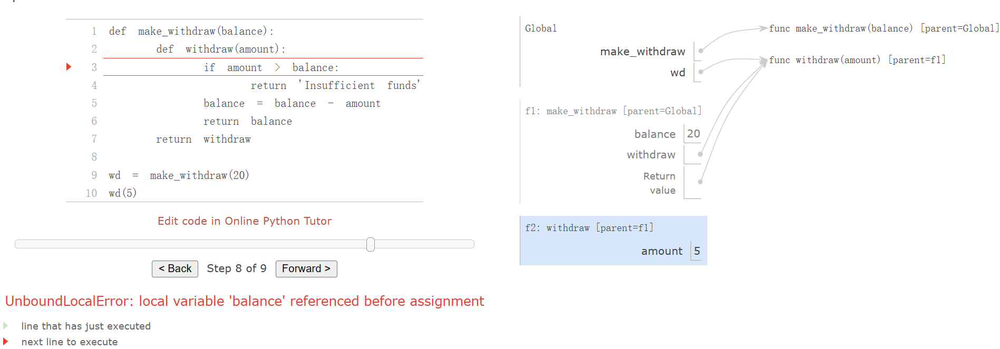
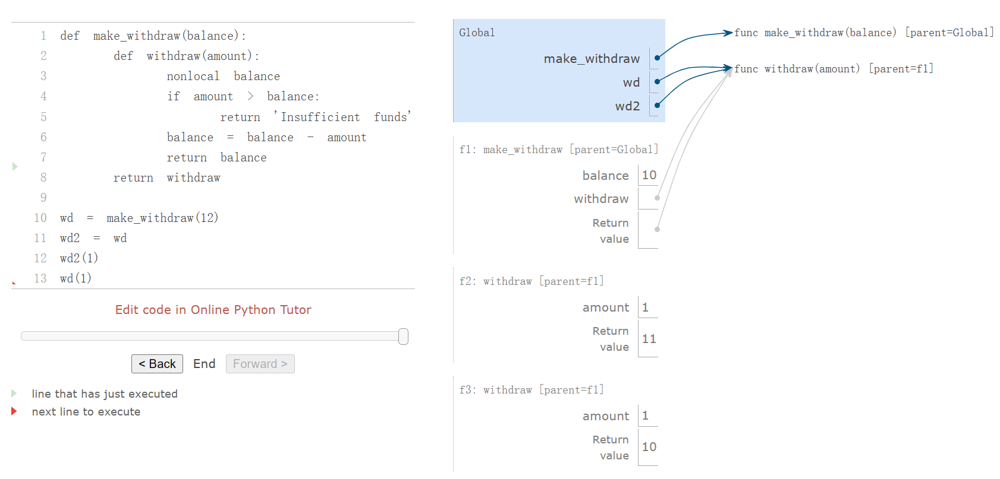

# Ch2.4, ch2.5

## Ch.2.4

### The Object Metaphor

*Objects* combine data values with behavior. Objects represent information, but also *behave* like the things that they represent.

we can introduce by example. A date is a kind of object.

```python
>>> from datetime import date
```

The name `date` is bound to a *class*. As we have seen, a class represents a kind of value. Individual dates are called *instances* of that class. Instances can be *constructed* by calling the class on arguments that characterize the instance.

```python
>>> tues = date(2014, 5, 13)
```

While `tues` was constructed from primitive numbers, it behaves like a date. For instance, subtracting it from another date will give a time difference, which we can print.

```python
>>> print(date(2014, 5, 19) - tues)
6 days, 0:00:00
```

Objects have *attributes*, which are named values that are part of the object. In Python, like many other programming languages, we use dot notation to designated an attribute of an object.

> <expression> . <name>

Above, the `<expression>` evaluates to an object, and `<name>` is the name of an attribute for that object.

Unlike the names that we have considered so far, these attribute names are not available in the general environment. Instead, attribute names are particular to the object instance preceding the dot.

```python
>>> tues.year
2014
```

Objects also have *methods*, which are function-valued attributes. Metaphorically, we say that the object "knows" how to carry out those methods. By implementation, methods are functions that compute their results from both their arguments and their object. For example, The `strftime` method (a classic function name meant to evoke "string format of time") of `tues` takes a single argument that specifies how to display a date (e.g., `%A` means that the day of the week should be spelled out in full).

```python
>>> tues.strftime('%A, %B %d')
'Tuesday, May 13'
```

In fact, all values in Python are objects. That is, all values have behavior and attributes. They act like the values they represent.

### Sequence Objects

Mutable objects are used to represent values that change over time. A person is the same person from one day to the next, despite having aged, received a haircut, or otherwise changed in some way. Similarly, an object may have changing properties due to *mutating* operations. For example, it is possible to change the contents of a list. Most changes are performed by invoking methods on list objects.

```python
>>> chinese = ['coin', 'string', 'myriad']  # A list literal
>>> suits = chinese                         # Two names refer to the same list
>>> suits.pop()             # Remove and return the final element
'myriad'
>>> suits.remove('string')  # Remove the first element that equals the argument
>>> suits.append('cup')              # Add an element to the end
>>> suits.extend(['sword', 'club'])  # Add all elements of a sequence to the end
>>> suits[2] = 'spade'  # Replace an element
>>> suits
['coin', 'cup', 'spade', 'club']
>>> suits[0:2] = ['heart', 'diamond']  # Replace a slice
>>> suits
['heart', 'diamond', 'spade', 'club']
```

Methods also exist for inserting, sorting, and reversing lists. All of these mutation operations change the value of the list; they do not create new list objects.

---

**Sharing and Identity.** Because we have been changing a single list rather than creating new lists, the object bound to the name `chinese` has also changed, because it is the same list object that was bound to `suits`!

```python
>>> chinese  # This name co-refers with "suits" to the same changing list
['heart', 'diamond', 'spade', 'club']
```

This behavior is new. Previously, if a name did not appear in a statement, then its value would not be affected by that statement. With mutable data, methods called on one name can affect another name at the same time.

Lists can be copied using the `list` constructor function. Changes to one list do not affect another, unless they share structure.

```python
>>> nest = list(suits)  # Bind "nest" to a second list with the same elements
>>> nest[0] = suits     # Create a nested list
```

According to this environment, changing the list referenced by `suits` will affect the nested list that is the first element of `nest`, but not the other elements.

```python
>>> suits.insert(2, 'Joker')  # Insert an element at index 2, shifting the rest
>>> nest
[['heart', 'diamond', 'Joker', 'spade', 'club'], 'diamond', 'spade', 'club']
```

And likewise, undoing this change in the first element of `nest` will change `suit` as well.

```python
>>> nest[0].pop(2)
'Joker'
>>> suits
['heart', 'diamond', 'spade', 'club']
```


---

Because two lists may have the same contents but in fact be different lists, we require a means to test whether two objects are the same. Python includes two comparison operators, called `is` and `is not`, that test whether two expressions in fact evaluate to the identical object. Two objects are identical if they are equal in their current value, and any change to one will always be reflected in the other. Identity is a stronger condition than equality.

```python
>>> suits is nest[0]
True
>>> suits is ['heart', 'diamond', 'spade', 'club']
False
>>> suits == ['heart', 'diamond', 'spade', 'club']
True
```

The final two comparisons illustrate the difference between `is` and `==`. The former checks for identity, while the latter checks for the equality of contents.

---

**List comprehensions.** A list comprehension always creates a new list.

---

**Tuples.** A tuple, an instance of the built-in `tuple` type, is an immutable sequence. Tuples are created using a tuple literal that separates element expressions by commas. Parentheses are optional but used commonly in practice. Any objects can be placed within tuples.

Empty and one-element tuples have special literal syntax.

```python
>>> ()    # 0 elements
()
>>> (10,) # 1 element
(10,)
```

Like lists, tuples have a finite length and support element selection. They also have a few methods that are also available for lists, such as `count` and `index`.

```python
>>> code = ("up", "up", "down", "down") + ("left", "right") * 2
>>> len(code)
8
>>> code[3]
'down'
>>> code.count("down")
2
>>> code.index("left")
4
```

However, the methods for manipulating the contents of a list are not available for tuples because tuples are immutable.

While it is not possible to change which elements are in a tuple, it is possible to change the value of a mutable element contained within a tuple.

Tuples are used implicitly in multiple assignment. An assignment of two values to two names creates a two-element tuple and then unpacks it.

### Dictionaries

Dictionaries are Python's built-in data type for storing and manipulating correspondence relationships. A dictionary contains key-value pairs, where both the keys and values are objects. The purpose of a dictionary is to provide an abstraction for storing and retrieving values that are indexed not by consecutive integers, but by descriptive keys.

Strings commonly serve as keys, because strings are our conventional representation for names of things. This dictionary literal gives the values of various Roman numerals.

```python
>>> numerals = {'I': 1.0, 'V': 5, 'X': 10}
```

Looking up values by their keys uses the element selection operator that we previously applied to sequences.

```python
>>> numerals['X']
10
```

A dictionary can have at most one value for each key. Adding new key-value pairs and changing the existing value for a key can both be achieved with assignment statements.

```python
>>> numerals['I'] = 1
>>> numerals['L'] = 50
>>> numerals
{'I': 1, 'X': 10, 'L': 50, 'V': 5}
```

Notice that `'L'` was not added to the end of the output above. Dictionaries are unordered collections of key-value pairs. When we print a dictionary, the keys and values are rendered in some order, but as users of the language we cannot predict what that order will be. The order may change when running a program multiple times.

The dictionary type also supports various methods of iterating over the contents of the dictionary as a whole. The methods `keys`, `values`, and `items` all return iterable values.

```python
>>> sum(numerals.values())
66
```

A list of key-value pairs can be converted into a dictionary by calling the `dict` constructor function.

```python
>>> dict([(3, 9), (4, 16), (5, 25)])
{3: 9, 4: 16, 5: 25}
```

Dictionaries do have some restrictions:

- A key of a dictionary cannot be or contain a mutable value.
- There can be at most one value for a given key.

A useful method implemented by dictionaries is `get`, which returns either the value for a key, if the key is present, or a default value. The arguments to `get` are the key and the default value.

```python
>>> numerals.get('A', 0)
0
>>> numerals.get('V', 0)
5
```

---

Dictionaries also have a comprehension syntax analogous to those of lists. A key expression and a value expression are separated by a colon. Evaluating a dictionary comprehension creates a new dictionary object.

```python
>>> {x: x*x for x in range(3,6)}
{3: 9, 4: 16, 5: 25}
```

### Local State

An implementation of `make_withdraw` requires a new kind of statement: a `nonlocal` statement. When we call `make_withdraw`, we bind the name `balance` to the initial amount. We then define and return a local function, `withdraw`, which updates and returns the value of `balance` when called.

```python
>>> def make_withdraw(balance):
        """Return a withdraw function that draws down balance with each call."""
        def withdraw(amount):
            nonlocal balance                 # Declare the name "balance" nonlocal
            if amount > balance:
                return 'Insufficient funds'
            balance = balance - amount       # Re-bind the existing balance name
            return balance
        return withdraw
```

The `nonlocal` statement declares that whenever we change the binding of the name `balance`, the binding is changed in the first frame in which `balance` is already bound. Recall that without the `nonlocal` statement, an assignment statement would always bind a name in the first frame of the current environment. The `nonlocal` statement indicates that the name appears somewhere in the environment other than the first (local) frame or the last (global) frame.

Ever since we first encountered nested `def` statements, we have observed that a locally defined function can look up names outside of its local frames. No `nonlocal` statement is required to *access* a non-local name. By contrast, only after a `nonlocal` statement can a function *change* the binding of names in these frames.

#### Python Particulars

1. This pattern of non-local assignment is a general feature of programming languages with higher-order functions and lexical scope. Most other languages do not require a `nonlocal` statement at all. Instead, non-local assignment is often the default behavior of assignment statements.
2. Python also has an unusual restriction regarding the lookup of names: within the body of a function, all instances of a name must refer to the same frame. As a result, Python cannot look up the value of a name in a non-local frame, then bind that same name in the local frame, because the same name would be accessed in two different frames in the same function. This restriction allows Python to pre-compute which frame contains each name before executing the body of a function. When this restriction is violated, a confusing error message results. To demonstrate, the `make_withdraw` example is repeated below with the `nonlocal` statement removed.This UnboundLocalError appears because balance is assigned locally in line 5, and so Python assumes that all references to balance must appear in the local frame as well. This error occurs before line 5 is ever executed, implying that Python has considered line 5 in some way before executing line 3. As we study interpreter design, we will see that pre-computing facts about a function body before executing it is quite common. In this case, Python's pre-processing restricted the frame in which balance could appear, and thus prevented the name from being found. Adding a nonlocal statement corrects this error. The nonlocal statement did not exist in Python 2.

### The Benefits of Non-Local Assignment

We can extend our example to illustrate this point. A second call to `make_withdraw` returns a second `withdraw` function that has a different parent. We bind this second function to the name `wd2` in the global frame.


Now, we see that there are in fact two bindings for the name `balance` in two different frames, and each `withdraw` function has a different parent. The name `wd` is bound to a function with a balance of 20, while `wd2` is bound to a different function with a balance of 7.

Calling `wd2` changes the binding of its non-local `balance` name, but does not affect the function bound to the name `withdraw`. A future call to `wd` is unaffected by the changing balance of `wd2`; its balance is still 20.

In this way, each instance of `withdraw` maintains its own balance state, but that state is inaccessible to any other function in the program. Viewing this situation at a higher level, we have created an abstraction of a bank account that manages its own internals but behaves in a way that models accounts in the world: it changes over time based on its own history of withdrawal requests.

### The Cost of Non-Local Assignment

Previously, our values did not change; only our names and bindings changed. When two names `a` and `b` were both bound to the value 4, it did not matter whether they were bound to the same 4 or different 4's. As far as we could tell, there was only one 4 object that never changed.

However, functions with state do not behave this way. When two names `wd` and `wd2` are both bound to a `withdraw` function, it *does* matter whether they are bound to the same function or different instances of that function. Consider the following example, which contrasts the one we just analyzed. In this case, calling the function named by `wd2` did change the value of the function named by `wd`, because both names refer to the same function.



It is not unusual for two names to co-refer to the same value in the world, and so it is in our programs. But, as values change over time, we must be very careful to understand the effect of a change on other names that might refer to those values.

The key to correctly analyzing code with non-local assignment is to remember that only function calls can introduce new frames. Assignment statements always change bindings in existing frames. In this case, unless `make_withdraw` is called twice, there can be only one binding for `balance`.

**Sameness and change.** These subtleties arise because, by introducing non-pure functions that change the non-local environment, we have changed the nature of expressions. An expression that contains only pure function calls is *referentially transparent*; its value does not change if we substitute one of its subexpression with the value of that subexpression.

Re-binding operations violate the conditions of referential transparency because they do more than return a value; they change the environment. When we introduce arbitrary re-binding, we encounter a thorny epistemological issue: what it means for two values to be the same. In our environment model of computation, two separately defined functions are not the same, because changes to one may not be reflected in the other.

### Implementing Lists and Dictionaries

#### Implementing Lists

We will represent a mutable linked list by a function that has a linked list as its local state. Lists need to have an identity, like any mutable value. In particular, we cannot use `None` to represent an empty mutable list, because two empty lists are not identical values (e.g., appending to one does not append to the other), but `None is None`. On the other hand, two different functions that each have `empty` as their local state will suffice to distinguish two empty lists.

If a mutable linked list is a function, what arguments does it take? The answer exhibits a general pattern in programming: the function is a dispatch function and its arguments are first a message, followed by additional arguments to parameterize that method. This message is a string naming what the function should do. Dispatch functions are effectively many functions in one: the message determines the behavior of the function, and the additional arguments are used in that behavior.

Our mutable list will respond to five different messages: `len`, `getitem`, `push_first`, `pop_first`, and `str`. The first two implement the behaviors of the sequence abstraction. The next two add or remove the first element of the list. The final message returns a string representation of the whole linked list.

```python
>>> def mutable_link():
        """Return a functional implementation of a mutable linked list."""
        contents = empty
        def dispatch(message, value=None):
            nonlocal contents
            if message == 'len':
                return len_link(contents)
            elif message == 'getitem':
                return getitem_link(contents, value)
            elif message == 'push_first':
                contents = link(value, contents)
            elif message == 'pop_first':
                f = first(contents)
                contents = rest(contents)
                return f
            elif message == 'str':
                return join_link(contents, ", ")
        return dispatch
```

We can also add a convenience function to construct a functionally implemented linked list from any built-in sequence, simply by adding each element in reverse order.

```python
>>> def to_mutable_link(source):
        """Return a functional list with the same contents as source."""
        s = mutable_link()
        for element in reversed(source):
            s('push_first', element)
        return s
```

In the definition above, the function `reversed` takes and returns an iterable value; it is another example of a function that processes sequences.

At this point, we can construct a functionally implemented mutable linked lists. Note that the linked list itself is a function.

```python
>>> s = to_mutable_link(suits)
>>> type(s)
<class 'function'>
>>> print(s('str'))
heart, diamond, spade, club
```

In addition, we can pass messages to the list `s` that change its contents, for instance removing the first element.

```python
>>> s('pop_first')
'heart'
>>> print(s('str'))
diamond, spade, club
```

In principle, the operations `push_first` and `pop_first` suffice to make arbitrary changes to a list. We can always empty out the list entirely and then replace its old contents with the desired result.

#### Implementing Dictionaries

We can also implement a value with similar behavior to a dictionary. In this case, we use a list of key-value pairs to store the contents of the dictionary. Each pair is a two-element list.

```python
>>> def dictionary():
        """Return a functional implementation of a dictionary."""
        records = []
        def getitem(key):
            matches = [r for r in records if r[0] == key]
            if len(matches) == 1:
                key, value = matches[0]
                return value
        def setitem(key, value):
            nonlocal records
            non_matches = [r for r in records if r[0] != key]
            records = non_matches + [[key, value]]
        def dispatch(message, key=None, value=None):
            if message == 'getitem':
                return getitem(key)
            elif message == 'setitem':
                setitem(key, value)
        return dispatch
```

Again, we use the message passing method to organize our implementation. We have supported two messages: `getitem` and `setitem`. To insert a value for a key, we filter out any existing records with the given key, then add one. In this way, we are assured that each key appears only once in records. To look up a value for a key, we filter for the record that matches the given key. We can now use our implementation to store and retrieve values.

```python
>>> d = dictionary()
>>> d('setitem', 3, 9)
>>> d('setitem', 4, 16)
>>> d('getitem', 3)
9
>>> d('getitem', 4)
16
```

This implementation of a dictionary is *not* optimized for fast record lookup, because each call must filter through all records. The built-in dictionary type is considerably more efficient. The way in which it is implemented is beyond the scope of this text.

### Dispatch Dictionaries

The dispatch function is a general method for implementing a message passing interface for abstract data. To implement message dispatch, we have thus far used conditional statements to compare the message string to a fixed set of known messages.

The built-in dictionary data type provides a general method for looking up a value for a key. Instead of using conditionals to implement dispatching, we can use dictionaries with string keys.

The mutable `account` data type below is implemented as a dictionary. It has a constructor `account` and selector `check_balance`, as well as functions to `deposit` or `withdraw` funds. Moreover, the local state of the account is stored in the dictionary alongside the functions that implement its behavior.

````python
def account(initial_balance):
    def deposit(amount):
        dispatch['balance'] += amount
        return dispatch['balance']
    def withdraw(amount):
        if amount > dispatch['balance']:
            return 'Insufficient funds'
        dispatch['balance'] -= amount
        return dispatch['balance']
    dispatch = {'deposit':   deposit,
                'withdraw':  withdraw,
                'balance':   initial_balance}
    return dispatch

def withdraw(account, amount):
    return account['withdraw'](amount)
def deposit(account, amount):
    return account['deposit'](amount)
def check_balance(account):
    return account['balance']
---
>>> a = account(20)
>>> deposit(a, 5)
25
>>> withdraw(a, 17)
8
>>> check_balance(a)
8
````

The name `dispatch` within the body of the `account` constructor is bound to a dictionary that contains the messages accepted by an account as keys. The *balance* is a number, while the messages *deposit* and *withdraw* are bound to functions. These functions have access to the `dispatch` dictionary, and so they can read and change the balance. By storing the balance in the dispatch dictionary rather than in the `account` frame directly, we avoid the need for `nonlocal` statements in `deposit` and `withdraw`.

## Ch.2.5

### 2.5.1  Objects and Classes

A class serves as a template for all objects whose type is that class. Every object is an instance of some particular class. The objects we have used so far all have built-in classes, but new user-defined classes can be created as well. A class definition specifies the attributes and methods shared among objects of that class.

### 2.5.2  Defining Classes

User-defined classes are created by `class` statements, which consist of a single clause. A class statement defines the class name, then includes a suite of statements to define the attributes of the class:

```python
class <name>:
    <suite>
```

When a class statement is executed, a new class is created and bound to `<name>` in the first frame of the current environment. The suite is then executed. Any names bound within the `<suite>` of a `class` statement, through `def` or assignment statements, create or modify attributes of the class.

Classes are typically organized around manipulating instance attributes, which are the name-value pairs associated with each instance of that class. The class specifies the instance attributes of its objects by defining a method for initializing new objects. For example, part of initializing an object of the `Account` class is to assign it a starting balance of 0.

The `<suite>` of a `class` statement contains `def` statements that define new methods for objects of that class. The method that initializes objects has a special name in Python, `__init__` (two underscores on each side of the word "init"), and is called the *constructor* for the class.

```python
>>> class Account:
        def __init__(self, account_holder):
            self.balance = 0
            self.holder = account_holder
```

The `__init__` method for `Account` has two formal parameters. The first one, `self`, is bound to the newly created `Account` object. The second parameter, `account_holder`, is bound to the argument passed to the class when it is called to be instantiated.

The constructor binds the instance attribute name `balance` to 0. It also binds the attribute name `holder` to the value of the name `account_holder`. The formal parameter `account_holder` is a local name in the `__init__` method. On the other hand, the name `holder` that is bound via the final assignment statement persists, because it is stored as an attribute of `self` using dot notation.

Having defined the `Account` class, we can instantiate it.

```python
>>> a = Account('Kirk')
```

This "call" to the `Account` class creates a new object that is an instance of `Account`, then calls the constructor function `__init__` with two arguments: the newly created object and the string `'Kirk'`. By convention, we use the parameter name `self` for the first argument of a constructor, because it is bound to the object being instantiated. This convention is adopted in virtually all Python code.

Now, we can access the object's `balance` and `holder` using dot notation.

```python
>>> a.balance
0
>>> a.holder
'Kirk'
```

#### Identity 

Each new account instance has its own balance attribute, the value of which is independent of other objects of the same class.

```python
>>> b = Account('Spock')
>>> b.balance = 200
>>> [acc.balance for acc in (a, b)]
[0, 200]
```

To enforce this separation, every object that is an instance of a user-defined class has a unique identity. Object identity is compared using the `is` and `is not` operators.

```python
>>> a is a
True
>>> a is not b
True
```

Despite being constructed from identical calls, the objects bound to `a` and `b` are not the same. As usual, binding an object to a new name using assignment does not create a new object.

```python
>>> c = a
>>> c is a
True
```

New objects that have user-defined classes are only created when a class (such as `Account`) is instantiated with call expression syntax.

#### Methods

Object methods are also defined by a `def` statement in the suite of a `class` statement. Below, `deposit` and `withdraw` are both defined as methods on objects of the `Account` class.

```python
>>> class Account:
        def __init__(self, account_holder):
            self.balance = 0
            self.holder = account_holder
        def deposit(self, amount):
            self.balance = self.balance + amount
            return self.balance
        def withdraw(self, amount):
            if amount > self.balance:
                return 'Insufficient funds'
            self.balance = self.balance - amount
            return self.balance
```

While method definitions do not differ from function definitions in how they are declared, method definitions do have a different effect when executed. The function value that is created by a `def` statement within a `class` statement is bound to the declared name, but bound locally within the class as an attribute. That value is invoked as a method using dot notation from an instance of the class.

Each method definition again includes a special first parameter `self`, which is bound to the object on which the method is invoked. For example, let us say that `deposit` is invoked on a particular `Account` object and passed a single argument value: the amount deposited. The object itself is bound to `self`, while the argument is bound to `amount`. All invoked methods have access to the object via the `self` parameter, and so they can all access and manipulate the object's state.

To invoke these methods, we again use dot notation, as illustrated below.

```python
>>> spock_account = Account('Spock')
>>> spock_account.deposit(100)
100
>>> spock_account.withdraw(90)
10
>>> spock_account.withdraw(90)
'Insufficient funds'
>>> spock_account.holder
'Spock'
```

When a method is invoked via dot notation, the object itself (bound to `spock_account`, in this case) plays a dual role. First, it determines what the name `withdraw` means; `withdraw` is not a name in the environment, but instead a name that is local to the `Account` class. Second, it is bound to the first parameter `self` when the `withdraw` method is invoked.

### 2.5.3  Message Passing and Dot Expressions

#### Dot expressions

The code fragment `spock_account.deposit` is called a *dot expression*. A dot expression consists of an expression, a dot, and a name:

```python
<expression> . <name>
```

The `<expression>` can be any valid Python expression, but the `<name>` must be a simple name (not an expression that evaluates to a name). A dot expression evaluates to the value of the attribute with the given `<name>`, for the object that is the value of the `<expression>`.

The built-in function `getattr` also returns an attribute for an object by name. It is the function equivalent of dot notation. Using `getattr`, we can look up an attribute using a string, just as we did with a dispatch dictionary.

```python
>>> getattr(spock_account, 'balance')
10
```

We can also test whether an object has a named attribute with `hasattr`.

```python
>>> hasattr(spock_account, 'deposit')
True
```

The attributes of an object include all of its instance attributes, along with all of the attributes (including methods) defined in its class. Methods are attributes of the class that require special handling.

#### Methods and functions

When a method is invoked on an object, that object is implicitly passed as the first argument to the method. That is, the object that is the value of the `<expression>` to the left of the dot is passed automatically as the first argument to the method named on the right side of the dot expression. As a result, the object is bound to the parameter `self`.

To achieve automatic `self` binding, Python distinguishes between *functions*, which we have been creating since the beginning of the text, and *bound methods*, which couple together a function and the object on which that method will be invoked. A bound method value is already associated with its first argument, the instance on which it was invoked, which will be named `self` when the method is called.

We can see the difference in the interactive interpreter by calling `type` on the returned values of dot expressions. As an attribute of a class, a method is just a function, but as an attribute of an instance, it is a bound method:

```python
>>> type(Account.deposit)
<class 'function'>
>>> type(spock_account.deposit)
<class 'method'>
```

These two results differ only in the fact that the first is a standard two-argument function with parameters `self` and `amount`. The second is a one-argument method, where the name `self` will be bound to the object named `spock_account` automatically when the method is called, while the parameter `amount` will be bound to the argument passed to the method. Both of these values, whether function values or bound method values, are associated with the same `deposit` function body.

We can call `deposit` in two ways: as a function and as a bound method. In the former case, we must supply an argument for the `self` parameter explicitly. In the latter case, the `self` parameter is bound automatically.

```python
>>> Account.deposit(spock_account, 1001)  # The deposit function takes 2 arguments
1011
>>> spock_account.deposit(1000)           # The deposit method takes 1 argument
2011
```

The function `getattr` behaves exactly like dot notation: if its first argument is an object but the name is a method defined in the class, then `getattr` returns a bound method value. On the other hand, if the first argument is a class, then `getattr` returns the attribute value directly, which is a plain function.

#### Naming Conventions

Class names are conventionally written using the CapWords convention (also called CamelCase because the capital letters in the middle of a name look like humps). Method names follow the standard convention of naming functions using lowercased words separated by underscores.

In some cases, there are instance variables and methods that are related to the maintenance and consistency of an object that we don't want users of the object to see or use. They are not part of the abstraction defined by a class, but instead part of the implementation. Python's convention dictates that if an attribute name starts with an underscore, it should only be accessed within methods of the class itself, rather than by users of the class.

### 2.5.4  Class Attributes

Class attributes are created by assignment statements in the suite of a `class` statement, outside of any method definition. In the broader developer community, class attributes may also be called class variables or static variables. The following class statement creates a class attribute for `Account` with the name `interest`.

```python
>>> class Account:
        interest = 0.02            # A class attribute
        def __init__(self, account_holder):
            self.balance = 0
            self.holder = account_holder
        # Additional methods would be defined here
```

This attribute can still be accessed from any instance of the class.

```python
>>> spock_account = Account('Spock')
>>> kirk_account = Account('Kirk')
>>> spock_account.interest
0.02
>>> kirk_account.interest
0.02
```

However, a single assignment statement to a class attribute changes the value of the attribute for all instances of the class.

```python
>>> Account.interest = 0.04
>>> spock_account.interest
0.04
>>> kirk_account.interest
0.04
```

#### Attribute names

We have introduced enough complexity into our object system that we have to specify how names are resolved to particular attributes. After all, we could easily have a class attribute and an instance attribute with the same name.

As we have seen, a dot expression consists of an expression, a dot, and a name:

```python
<expression> . <name>
```

To evaluate a dot expression:

1. Evaluate the `<expression>` to the left of the dot, which yields the *object* of the dot expression.
2. `<name>` is matched against the instance attributes of that object; if an attribute with that name exists, its value is returned.
3. If `<name>` does not appear among instance attributes, then `<name>` is looked up in the class, which yields a class attribute value.
4. That value is returned unless it is a function, in which case a bound method is returned instead.

In this evaluation procedure, instance attributes are found before class attributes, just as local names have priority over global in an environment. Methods defined within the class are combined with the object of the dot expression to form a bound method during the fourth step of this evaluation procedure. The procedure for looking up a name in a class has additional nuances that will arise shortly, once we introduce class inheritance.

#### Attribute assignment 

All assignment statements that contain a dot expression on their left-hand side affect attributes for the object of that dot expression. If the object is an instance, then assignment sets an instance attribute. If the object is a class, then assignment sets a class attribute. As a consequence of this rule, assignment to an attribute of an object cannot affect the attributes of its class. The examples below illustrate this distinction.

If we assign to the named attribute `interest` of an account instance, we create a new instance attribute that has the same name as the existing class attribute.

```python
>>> kirk_account.interest = 0.08
```

and that attribute value will be returned from a dot expression.

```python
>>> kirk_account.interest
0.08
```


However, the class attribute `interest` still retains its original value, which is returned for all other accounts.

```python
>>> spock_account.interest
0.04
```

Changes to the class attribute `interest` will affect `spock_account`, but the instance attribute for `kirk_account` will be unaffected.

```python
>>> Account.interest = 0.05  # changing the class attribute
>>> spock_account.interest     # changes instances without like-named instance attributes
0.05
>>> kirk_account.interest     # but the existing instance attribute is unaffected
0.08
```

### 2.5.5  Inheritance

When working in the object-oriented programming paradigm, we often find that different types are related. In particular, we find that similar classes differ in their amount of specialization. Two classes may have similar attributes, but one represents a special case of the other.

For example, we may want to implement a checking account, which is different from a standard account. A checking account charges an extra $1 for each withdrawal and has a lower interest rate. Here, we demonstrate the desired behavior.

```python
>>> ch = CheckingAccount('Spock')
>>> ch.interest     # Lower interest rate for checking accounts
0.01
>>> ch.deposit(20)  # Deposits are the same
20
>>> ch.withdraw(5)  # withdrawals decrease balance by an extra charge
14
```

A `CheckingAccount` is a specialization of an `Account`. In OOP terminology, the generic account will serve as the base class of `CheckingAccount`, while `CheckingAccount` will be a subclass of `Account`. (The terms *parent class* and *superclass* are also used for the base class, while *child class* is also used for the subclass.)

A subclass *inherits* the attributes of its base class, but may *override* certain attributes, including certain methods. With inheritance, we only specify what is different between the subclass and the base class. Anything that we leave unspecified in the subclass is automatically assumed to behave just as it would for the base class.

### 2.5.6  Using Inheritance

First, we give a full implementation of the `Account` class, which includes docstrings for the class and its methods.

```python
>>> class Account:
        """A bank account that has a non-negative balance."""
        interest = 0.02
        def __init__(self, account_holder):
            self.balance = 0
            self.holder = account_holder
        def deposit(self, amount):
            """Increase the account balance by amount and return the new balance."""
            self.balance = self.balance + amount
            return self.balance
        def withdraw(self, amount):
            """Decrease the account balance by amount and return the new balance."""
            if amount > self.balance:
                return 'Insufficient funds'
            self.balance = self.balance - amount
            return self.balance
```

A full implementation of `CheckingAccount` appears below. We specify inheritance by placing an expression that evaluates to the base class in parentheses after the class name.

```python
>>> class CheckingAccount(Account):
        """A bank account that charges for withdrawals."""
        withdraw_charge = 1
        interest = 0.01
        def withdraw(self, amount):
            return Account.withdraw(self, amount + self.withdraw_charge)
```

Here, we introduce a class attribute `withdraw_charge` that is specific to the `CheckingAccount` class. We assign a lower value to the `interest` attribute. We also define a new `withdraw` method to override the behavior defined in the `Account` class. With no further statements in the class suite, all other behavior is inherited from the base class `Account`.

```python
>>> checking = CheckingAccount('Sam')
>>> checking.deposit(10)
10
>>> checking.withdraw(5)
4
>>> checking.interest
0.01
```

The expression `checking.deposit` evaluates to a bound method for making deposits, which was defined in the `Account` class. When Python resolves a name in a dot expression that is not an attribute of the instance, it looks up the name in the class. In fact, the act of "looking up" a name in a class tries to find that name in every base class in the inheritance chain for the original object's class. We can define this procedure recursively. To look up a name in a class.

1. If it names an attribute in the class, return the attribute value.
2. Otherwise, look up the name in the base class, if there is one.

The class of an object stays constant throughout. Even though the `deposit` method was found in the `Account` class, `deposit` is called with `self` bound to an instance of `CheckingAccount`, not of `Account`.

#### Interfaces

It is extremely common in object-oriented programs that different types of objects will share the same attribute names. An *object interface* is a collection of attributes and conditions on those attributes. For example, all accounts must have `deposit` and `withdraw` methods that take numerical arguments, as well as a `balance` attribute. The classes `Account` and `CheckingAccount` both implement this interface. Inheritance specifically promotes name sharing in this way. In some programming languages such as Java, interface implementations must be explicitly declared. In others such as Python, Ruby, and Go, any object with the appropriate names implements an interface.

The parts of your program that use objects (rather than implementing them) are most robust to future changes if they do not make assumptions about object types, but instead only about their attribute names. That is, they use the object abstraction, rather than assuming anything about its implementation.

For example, let us say that we run a lottery, and we wish to deposit $5 into each of a list of accounts. The following implementation does not assume anything about the types of those accounts, and therefore works equally well with any type of object that has a `deposit` method:

```python
>>> def deposit_all(winners, amount=5):
        for account in winners:
            account.deposit(amount)
```

The function `deposit_all` above assumes only that each `account` satisfies the account object abstraction, and so it will work with any other account classes that also implement this interface. Assuming a particular class of account would violate the abstraction barrier of the account object abstraction. For example, the following implementation will not necessarily work with new kinds of accounts:

```python
>>> def deposit_all(winners, amount=5):
        for account in winners:
            Account.deposit(account, amount)
```

We will address this topic in more detail later in the chapter.

### 2.5.7  Multiple Inheritance

Python supports the concept of a subclass inheriting attributes from multiple base classes, a language feature called *multiple inheritance*.

Suppose that we have a `SavingsAccount` that inherits from `Account`, but charges customers a small fee every time they make a deposit.

```python
>>> class SavingsAccount(Account):
        deposit_charge = 2
        def deposit(self, amount):
            return Account.deposit(self, amount - self.deposit_charge)
```

Then, a clever executive conceives of an `AsSeenOnTVAccount` account with the best features of both `CheckingAccount` and `SavingsAccount`: withdrawal fees, deposit fees, and a low interest rate. It's both a checking and a savings account in one! "If we build it," the executive reasons, "someone will sign up and pay all those fees. We'll even give them a dollar."

```python
>>> class AsSeenOnTVAccount(CheckingAccount, SavingsAccount):
        def __init__(self, account_holder):
            self.holder = account_holder
            self.balance = 1           # A free dollar!
```

In fact, this implementation is complete. Both withdrawal and deposits will generate fees, using the function definitions in `CheckingAccount` and `SavingsAccount` respectively.

```python
>>> such_a_deal = AsSeenOnTVAccount("John")
>>> such_a_deal.balance
1
>>> such_a_deal.deposit(20)            # $2 fee from SavingsAccount.deposit
19
>>> such_a_deal.withdraw(5)            # $1 fee from CheckingAccount.withdraw
13
```

Non-ambiguous references are resolved correctly as expected:

```python
>>> such_a_deal.deposit_charge
2
>>> such_a_deal.withdraw_charge
1
```

But what about when the reference is ambiguous, such as the reference to the `withdraw` method that is defined in both `Account` and `CheckingAccount`? The figure below depicts an *inheritance graph* for the `AsSeenOnTVAccount` class. Each arrow points from a subclass to a base class.


For a simple "diamond" shape like this, Python resolves names from left to right, then upwards. In this example, Python checks for an attribute name in the following classes, in order, until an attribute with that name is found:

```
AsSeenOnTVAccount, CheckingAccount, SavingsAccount, Account, object
```

There is no correct solution to the inheritance ordering problem, as there are cases in which we might prefer to give precedence to certain inherited classes over others. However, any programming language that supports multiple inheritance must select some ordering in a consistent way, so that users of the language can predict the behavior of their programs.

**Further reading.** Python resolves this name using a recursive algorithm called the C3 Method Resolution Ordering. The method resolution order of any class can be queried using the `mro` method on all classes.

```python
>>> [c.__name__ for c in AsSeenOnTVAccount.mro()]
['AsSeenOnTVAccount', 'CheckingAccount', 'SavingsAccount', 'Account', 'object']
```


