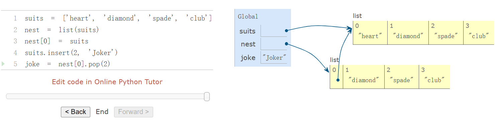
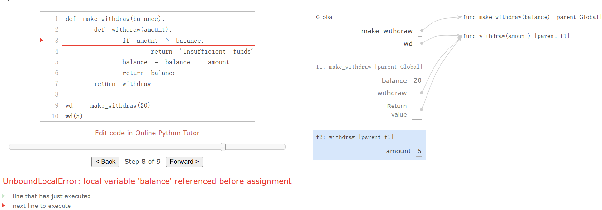
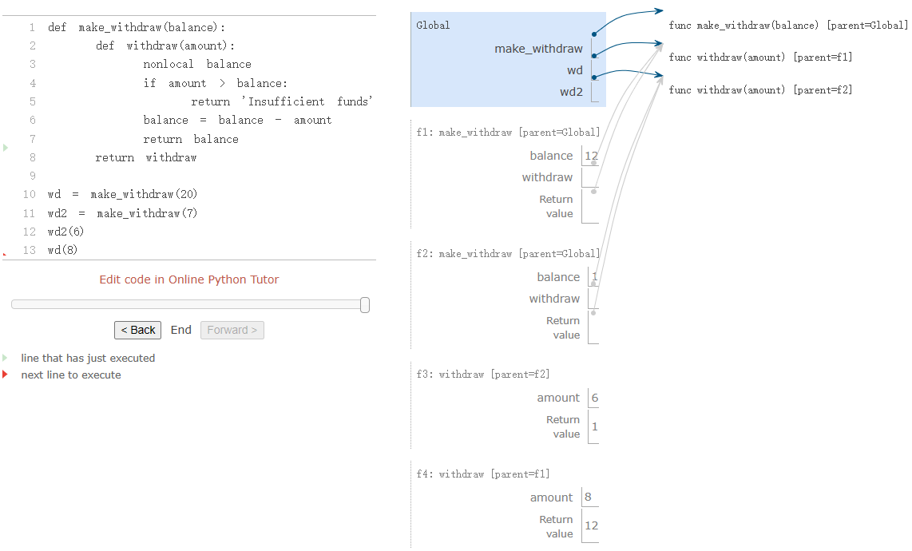

# Ch2.24

## Ch.2.4

### The Object Metaphor

*Objects* combine data values with behavior. Objects represent information, but also *behave* like the things that they represent.

we can introduce by example. A date is a kind of object.

```python
>>> from datetime import date
```

The name `date` is bound to a *class*. As we have seen, a class represents a kind of value. Individual dates are called *instances* of that class. Instances can be *constructed* by calling the class on arguments that characterize the instance.

```python
>>> tues = date(2014, 5, 13)
```

While `tues` was constructed from primitive numbers, it behaves like a date. For instance, subtracting it from another date will give a time difference, which we can print.

```python
>>> print(date(2014, 5, 19) - tues)
6 days, 0:00:00
```

Objects have *attributes*, which are named values that are part of the object. In Python, like many other programming languages, we use dot notation to designated an attribute of an object.

> <expression> . <name>

Above, the `<expression>` evaluates to an object, and `<name>` is the name of an attribute for that object.

Unlike the names that we have considered so far, these attribute names are not available in the general environment. Instead, attribute names are particular to the object instance preceding the dot.

```python
>>> tues.year
2014
```

Objects also have *methods*, which are function-valued attributes. Metaphorically, we say that the object "knows" how to carry out those methods. By implementation, methods are functions that compute their results from both their arguments and their object. For example, The `strftime` method (a classic function name meant to evoke "string format of time") of `tues` takes a single argument that specifies how to display a date (e.g., `%A` means that the day of the week should be spelled out in full).

```python
>>> tues.strftime('%A, %B %d')
'Tuesday, May 13'
```

In fact, all values in Python are objects. That is, all values have behavior and attributes. They act like the values they represent.

### Sequence Objects

Mutable objects are used to represent values that change over time. A person is the same person from one day to the next, despite having aged, received a haircut, or otherwise changed in some way. Similarly, an object may have changing properties due to *mutating* operations. For example, it is possible to change the contents of a list. Most changes are performed by invoking methods on list objects.

```python
>>> chinese = ['coin', 'string', 'myriad']  # A list literal
>>> suits = chinese                         # Two names refer to the same list
>>> suits.pop()             # Remove and return the final element
'myriad'
>>> suits.remove('string')  # Remove the first element that equals the argument
>>> suits.append('cup')              # Add an element to the end
>>> suits.extend(['sword', 'club'])  # Add all elements of a sequence to the end
>>> suits[2] = 'spade'  # Replace an element
>>> suits
['coin', 'cup', 'spade', 'club']
>>> suits[0:2] = ['heart', 'diamond']  # Replace a slice
>>> suits
['heart', 'diamond', 'spade', 'club']
```

Methods also exist for inserting, sorting, and reversing lists. All of these mutation operations change the value of the list; they do not create new list objects.

---

**Sharing and Identity.** Because we have been changing a single list rather than creating new lists, the object bound to the name `chinese` has also changed, because it is the same list object that was bound to `suits`!

```python
>>> chinese  # This name co-refers with "suits" to the same changing list
['heart', 'diamond', 'spade', 'club']
```

This behavior is new. Previously, if a name did not appear in a statement, then its value would not be affected by that statement. With mutable data, methods called on one name can affect another name at the same time.

Lists can be copied using the `list` constructor function. Changes to one list do not affect another, unless they share structure.

```python
>>> nest = list(suits)  # Bind "nest" to a second list with the same elements
>>> nest[0] = suits     # Create a nested list
```

According to this environment, changing the list referenced by `suits` will affect the nested list that is the first element of `nest`, but not the other elements.

```python
>>> suits.insert(2, 'Joker')  # Insert an element at index 2, shifting the rest
>>> nest
[['heart', 'diamond', 'Joker', 'spade', 'club'], 'diamond', 'spade', 'club']
```

And likewise, undoing this change in the first element of `nest` will change `suit` as well.

```python
>>> nest[0].pop(2)
'Joker'
>>> suits
['heart', 'diamond', 'spade', 'club']
```



---

Because two lists may have the same contents but in fact be different lists, we require a means to test whether two objects are the same. Python includes two comparison operators, called `is` and `is not`, that test whether two expressions in fact evaluate to the identical object. Two objects are identical if they are equal in their current value, and any change to one will always be reflected in the other. Identity is a stronger condition than equality.

```python
>>> suits is nest[0]
True
>>> suits is ['heart', 'diamond', 'spade', 'club']
False
>>> suits == ['heart', 'diamond', 'spade', 'club']
True
```

The final two comparisons illustrate the difference between `is` and `==`. The former checks for identity, while the latter checks for the equality of contents.

---

**List comprehensions.** A list comprehension always creates a new list.

---

**Tuples.** A tuple, an instance of the built-in `tuple` type, is an immutable sequence. Tuples are created using a tuple literal that separates element expressions by commas. Parentheses are optional but used commonly in practice. Any objects can be placed within tuples.

Empty and one-element tuples have special literal syntax.

```python
>>> ()    # 0 elements
()
>>> (10,) # 1 element
(10,)
```

Like lists, tuples have a finite length and support element selection. They also have a few methods that are also available for lists, such as `count` and `index`.

```python
>>> code = ("up", "up", "down", "down") + ("left", "right") * 2
>>> len(code)
8
>>> code[3]
'down'
>>> code.count("down")
2
>>> code.index("left")
4
```

However, the methods for manipulating the contents of a list are not available for tuples because tuples are immutable.

While it is not possible to change which elements are in a tuple, it is possible to change the value of a mutable element contained within a tuple.

Tuples are used implicitly in multiple assignment. An assignment of two values to two names creates a two-element tuple and then unpacks it.

### Dictionaries

Dictionaries are Python's built-in data type for storing and manipulating correspondence relationships. A dictionary contains key-value pairs, where both the keys and values are objects. The purpose of a dictionary is to provide an abstraction for storing and retrieving values that are indexed not by consecutive integers, but by descriptive keys.

Strings commonly serve as keys, because strings are our conventional representation for names of things. This dictionary literal gives the values of various Roman numerals.

```python
>>> numerals = {'I': 1.0, 'V': 5, 'X': 10}
```

Looking up values by their keys uses the element selection operator that we previously applied to sequences.

```python
>>> numerals['X']
10
```

A dictionary can have at most one value for each key. Adding new key-value pairs and changing the existing value for a key can both be achieved with assignment statements.

```python
>>> numerals['I'] = 1
>>> numerals['L'] = 50
>>> numerals
{'I': 1, 'X': 10, 'L': 50, 'V': 5}
```

Notice that `'L'` was not added to the end of the output above. Dictionaries are unordered collections of key-value pairs. When we print a dictionary, the keys and values are rendered in some order, but as users of the language we cannot predict what that order will be. The order may change when running a program multiple times.

The dictionary type also supports various methods of iterating over the contents of the dictionary as a whole. The methods `keys`, `values`, and `items` all return iterable values.

```python
>>> sum(numerals.values())
66
```

A list of key-value pairs can be converted into a dictionary by calling the `dict` constructor function.

```python
>>> dict([(3, 9), (4, 16), (5, 25)])
{3: 9, 4: 16, 5: 25}
```

Dictionaries do have some restrictions:

- A key of a dictionary cannot be or contain a mutable value.
- There can be at most one value for a given key.

A useful method implemented by dictionaries is `get`, which returns either the value for a key, if the key is present, or a default value. The arguments to `get` are the key and the default value.

```python
>>> numerals.get('A', 0)
0
>>> numerals.get('V', 0)
5
```

---

Dictionaries also have a comprehension syntax analogous to those of lists. A key expression and a value expression are separated by a colon. Evaluating a dictionary comprehension creates a new dictionary object.

```python
>>> {x: x*x for x in range(3,6)}
{3: 9, 4: 16, 5: 25}
```

### Local State

An implementation of `make_withdraw` requires a new kind of statement: a `nonlocal` statement. When we call `make_withdraw`, we bind the name `balance` to the initial amount. We then define and return a local function, `withdraw`, which updates and returns the value of `balance` when called.

```python
>>> def make_withdraw(balance):
        """Return a withdraw function that draws down balance with each call."""
        def withdraw(amount):
            nonlocal balance                 # Declare the name "balance" nonlocal
            if amount > balance:
                return 'Insufficient funds'
            balance = balance - amount       # Re-bind the existing balance name
            return balance
        return withdraw
```

The `nonlocal` statement declares that whenever we change the binding of the name `balance`, the binding is changed in the first frame in which `balance` is already bound. Recall that without the `nonlocal` statement, an assignment statement would always bind a name in the first frame of the current environment. The `nonlocal` statement indicates that the name appears somewhere in the environment other than the first (local) frame or the last (global) frame.

Ever since we first encountered nested `def` statements, we have observed that a locally defined function can look up names outside of its local frames. No `nonlocal` statement is required to *access* a non-local name. By contrast, only after a `nonlocal` statement can a function *change* the binding of names in these frames.

#### Python Particulars

1. This pattern of non-local assignment is a general feature of programming languages with higher-order functions and lexical scope. Most other languages do not require a `nonlocal` statement at all. Instead, non-local assignment is often the default behavior of assignment statements.
2. Python also has an unusual restriction regarding the lookup of names: within the body of a function, all instances of a name must refer to the same frame. As a result, Python cannot look up the value of a name in a non-local frame, then bind that same name in the local frame, because the same name would be accessed in two different frames in the same function. This restriction allows Python to pre-compute which frame contains each name before executing the body of a function. When this restriction is violated, a confusing error message results. To demonstrate, the `make_withdraw` example is repeated below with the `nonlocal` statement removed.This UnboundLocalError appears because balance is assigned locally in line 5, and so Python assumes that all references to balance must appear in the local frame as well. This error occurs before line 5 is ever executed, implying that Python has considered line 5 in some way before executing line 3. As we study interpreter design, we will see that pre-computing facts about a function body before executing it is quite common. In this case, Python's pre-processing restricted the frame in which balance could appear, and thus prevented the name from being found. Adding a nonlocal statement corrects this error. The nonlocal statement did not exist in Python 2.

### The Benefits of Non-Local Assignment

We can extend our example to illustrate this point. A second call to `make_withdraw` returns a second `withdraw` function that has a different parent. We bind this second function to the name `wd2` in the global frame.



Now, we see that there are in fact two bindings for the name `balance` in two different frames, and each `withdraw` function has a different parent. The name `wd` is bound to a function with a balance of 20, while `wd2` is bound to a different function with a balance of 7.

Calling `wd2` changes the binding of its non-local `balance` name, but does not affect the function bound to the name `withdraw`. A future call to `wd` is unaffected by the changing balance of `wd2`; its balance is still 20.

In this way, each instance of `withdraw` maintains its own balance state, but that state is inaccessible to any other function in the program. Viewing this situation at a higher level, we have created an abstraction of a bank account that manages its own internals but behaves in a way that models accounts in the world: it changes over time based on its own history of withdrawal requests.

### The Cost of Non-Local Assignment

Previously, our values did not change; only our names and bindings changed. When two names `a` and `b` were both bound to the value 4, it did not matter whether they were bound to the same 4 or different 4's. As far as we could tell, there was only one 4 object that never changed.

However, functions with state do not behave this way. When two names `wd` and `wd2` are both bound to a `withdraw` function, it *does* matter whether they are bound to the same function or different instances of that function. Consider the following example, which contrasts the one we just analyzed. In this case, calling the function named by `wd2` did change the value of the function named by `wd`, because both names refer to the same function.


It is not unusual for two names to co-refer to the same value in the world, and so it is in our programs. But, as values change over time, we must be very careful to understand the effect of a change on other names that might refer to those values.

The key to correctly analyzing code with non-local assignment is to remember that only function calls can introduce new frames. Assignment statements always change bindings in existing frames. In this case, unless `make_withdraw` is called twice, there can be only one binding for `balance`.

**Sameness and change.** These subtleties arise because, by introducing non-pure functions that change the non-local environment, we have changed the nature of expressions. An expression that contains only pure function calls is *referentially transparent*; its value does not change if we substitute one of its subexpression with the value of that subexpression.

Re-binding operations violate the conditions of referential transparency because they do more than return a value; they change the environment. When we introduce arbitrary re-binding, we encounter a thorny epistemological issue: what it means for two values to be the same. In our environment model of computation, two separately defined functions are not the same, because changes to one may not be reflected in the other.

### Implementing Lists and Dictionaries

#### Implementing Lists

We will represent a mutable linked list by a function that has a linked list as its local state. Lists need to have an identity, like any mutable value. In particular, we cannot use `None` to represent an empty mutable list, because two empty lists are not identical values (e.g., appending to one does not append to the other), but `None is None`. On the other hand, two different functions that each have `empty` as their local state will suffice to distinguish two empty lists.

If a mutable linked list is a function, what arguments does it take? The answer exhibits a general pattern in programming: the function is a dispatch function and its arguments are first a message, followed by additional arguments to parameterize that method. This message is a string naming what the function should do. Dispatch functions are effectively many functions in one: the message determines the behavior of the function, and the additional arguments are used in that behavior.

Our mutable list will respond to five different messages: `len`, `getitem`, `push_first`, `pop_first`, and `str`. The first two implement the behaviors of the sequence abstraction. The next two add or remove the first element of the list. The final message returns a string representation of the whole linked list.

```python
>>> def mutable_link():
        """Return a functional implementation of a mutable linked list."""
        contents = empty
        def dispatch(message, value=None):
            nonlocal contents
            if message == 'len':
                return len_link(contents)
            elif message == 'getitem':
                return getitem_link(contents, value)
            elif message == 'push_first':
                contents = link(value, contents)
            elif message == 'pop_first':
                f = first(contents)
                contents = rest(contents)
                return f
            elif message == 'str':
                return join_link(contents, ", ")
        return dispatch
```

We can also add a convenience function to construct a functionally implemented linked list from any built-in sequence, simply by adding each element in reverse order.

```python
>>> def to_mutable_link(source):
        """Return a functional list with the same contents as source."""
        s = mutable_link()
        for element in reversed(source):
            s('push_first', element)
        return s
```

In the definition above, the function `reversed` takes and returns an iterable value; it is another example of a function that processes sequences.

At this point, we can construct a functionally implemented mutable linked lists. Note that the linked list itself is a function.

```python
>>> s = to_mutable_link(suits)
>>> type(s)
<class 'function'>
>>> print(s('str'))
heart, diamond, spade, club
```

In addition, we can pass messages to the list `s` that change its contents, for instance removing the first element.

```python
>>> s('pop_first')
'heart'
>>> print(s('str'))
diamond, spade, club
```

In principle, the operations `push_first` and `pop_first` suffice to make arbitrary changes to a list. We can always empty out the list entirely and then replace its old contents with the desired result.

#### Implementing Dictionaries

We can also implement a value with similar behavior to a dictionary. In this case, we use a list of key-value pairs to store the contents of the dictionary. Each pair is a two-element list.

```python
>>> def dictionary():
        """Return a functional implementation of a dictionary."""
        records = []
        def getitem(key):
            matches = [r for r in records if r[0] == key]
            if len(matches) == 1:
                key, value = matches[0]
                return value
        def setitem(key, value):
            nonlocal records
            non_matches = [r for r in records if r[0] != key]
            records = non_matches + [[key, value]]
        def dispatch(message, key=None, value=None):
            if message == 'getitem':
                return getitem(key)
            elif message == 'setitem':
                setitem(key, value)
        return dispatch
```

Again, we use the message passing method to organize our implementation. We have supported two messages: `getitem` and `setitem`. To insert a value for a key, we filter out any existing records with the given key, then add one. In this way, we are assured that each key appears only once in records. To look up a value for a key, we filter for the record that matches the given key. We can now use our implementation to store and retrieve values.

```python
>>> d = dictionary()
>>> d('setitem', 3, 9)
>>> d('setitem', 4, 16)
>>> d('getitem', 3)
9
>>> d('getitem', 4)
16
```

This implementation of a dictionary is *not* optimized for fast record lookup, because each call must filter through all records. The built-in dictionary type is considerably more efficient. The way in which it is implemented is beyond the scope of this text.

### Dispatch Dictionaries

The dispatch function is a general method for implementing a message passing interface for abstract data. To implement message dispatch, we have thus far used conditional statements to compare the message string to a fixed set of known messages.

The built-in dictionary data type provides a general method for looking up a value for a key. Instead of using conditionals to implement dispatching, we can use dictionaries with string keys.

The mutable `account` data type below is implemented as a dictionary. It has a constructor `account` and selector `check_balance`, as well as functions to `deposit` or `withdraw` funds. Moreover, the local state of the account is stored in the dictionary alongside the functions that implement its behavior.

````python
def account(initial_balance):
    def deposit(amount):
        dispatch['balance'] += amount
        return dispatch['balance']
    def withdraw(amount):
        if amount > dispatch['balance']:
            return 'Insufficient funds'
        dispatch['balance'] -= amount
        return dispatch['balance']
    dispatch = {'deposit':   deposit,
                'withdraw':  withdraw,
                'balance':   initial_balance}
    return dispatch

def withdraw(account, amount):
    return account['withdraw'](amount)
def deposit(account, amount):
    return account['deposit'](amount)
def check_balance(account):
    return account['balance']
---
>>> a = account(20)
>>> deposit(a, 5)
25
>>> withdraw(a, 17)
8
>>> check_balance(a)
8
````

The name `dispatch` within the body of the `account` constructor is bound to a dictionary that contains the messages accepted by an account as keys. The *balance* is a number, while the messages *deposit* and *withdraw* are bound to functions. These functions have access to the `dispatch` dictionary, and so they can read and change the balance. By storing the balance in the dispatch dictionary rather than in the `account` frame directly, we avoid the need for `nonlocal` statements in `deposit` and `withdraw`.

### Propagating Constraints

